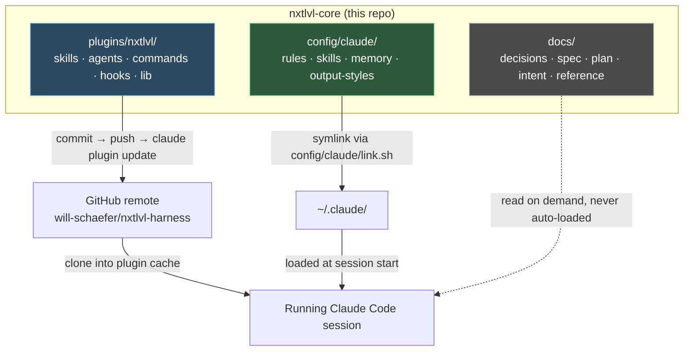
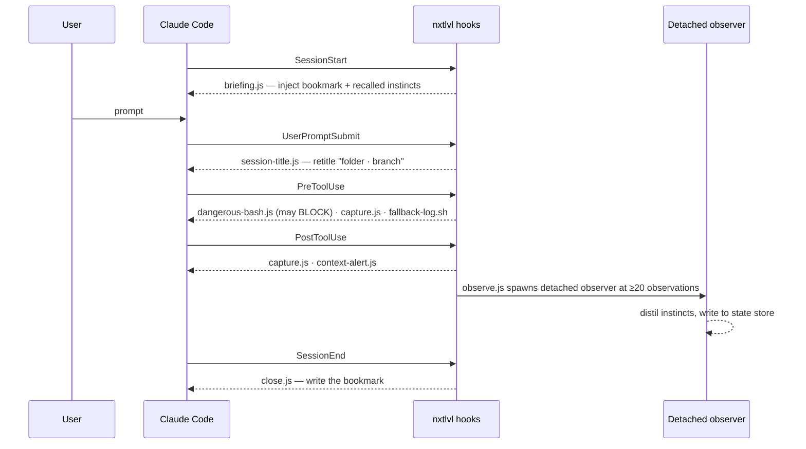

# Architecture

*Last Updated: 2026-07-28*

## Summary

`nxtlvl-core` is not an application — it is a **harness**: machinery that shapes how a coding agent
behaves. It ships no server, no database, and no user-facing interface. What it produces is
configuration and executable extensions that a Claude Code session loads at startup.

The repo is organized around **how an artifact reaches the running agent**, not by language or
feature. There are three delivery channels with genuinely different mechanics, and confusing them is
the most common mistake made in this codebase. A plugin edit that looks applied is not applied until
it is pushed and the plugin updated; a rules edit is live the moment it is saved.

The one substantial piece of running software is the **Context and Memory subsystem** — a set of
hooks and libraries that observe tool calls, distil them into learned "instincts" in a detached
background process, and re-inject the strong ones at session start. It has its own document:
[context-and-memory.md](./context-and-memory.md).

## The three delivery channels



| Channel | Source | Path to live | Latency |
|---|---|---|---|
| Plugin artifacts | `plugins/nxtlvl/`, `plugins/agent-dev/` | commit → push → `claude plugin update` → restart | Minutes; requires the remote |
| Machine-global config | `config/claude/` | symlinked into `~/.claude` by `config/claude/link.sh` | Immediate |
| Documentation | `docs/` | none — inert until read | On demand |

The plugin channel routes through GitHub because plugin installs clone from each repo's remote. The
local `nxtlvl-dev` marketplace does **not** bypass this.

## Components

### The nxtlvl plugin — `plugins/nxtlvl/`

The main deliverable. Declared by `plugins/nxtlvl/plugin.json` (`"namespace": false`, so skills are
addressed as `nxtlvl:<skill>`).

| Part | Location | Count | Role |
|---|---|---|---|
| Skills | `skills/` | 14 | Invokable procedures (brainstorming, review, call-model, …) |
| Agents | `agents/` | 9 | Subagent definitions, mostly read-only scouts |
| Commands | `commands/` | 13 | Slash-command front doors, mostly thin wrappers over skills |
| Hooks | `hooks/` | 9 registrations | Event-driven interception — see the pipeline below |
| Libraries | `lib/` | 13 modules | Shared logic behind the hooks — see [modules.md](./modules.md) |
| MCP servers | `mcp_config.json`, `.mcp.json` | 2 | DeepWiki and Context7, both over HTTP |

`skills/nxtlvl-router/` is the meta-skill: it decides which other skill applies to a task, and is the
intended discovery path for the rest.

### The agent-dev plugin — `plugins/agent-dev/`

A second, older plugin. Its `skills/continuous-learning-v2/` is the shell-and-Python predecessor of
the Context and Memory subsystem now implemented in `plugins/nxtlvl/lib/`. Treat it as legacy unless
working on it directly.

### Machine-global configuration — `config/claude/`

The source of truth for the agent configuration on this machine. `~/.claude` holds symlinks pointing
back here, so the repo copy is the one to edit.

| Directory | Contents |
|---|---|
| `rules/` | Seven pointer-style rule files (decisions, memory, hooks, git workflow, plain language, visual docs, approved acronyms) |
| `skills/` | Machine-global skills not shipped in the plugin |
| `memory/` | Persistent memory notes plus `MEMORY.md` as the index |
| `output-styles/` | Response-shaping styles |

The rule files are deliberately **pointer-heavy** — they name where knowledge lives rather than
inlining it, because everything here costs tokens on every session.

### Build tooling — `scripts/`

| Script | Purpose |
|---|---|
| `multi-cli-compiler/` | Compiles the Claude Code configuration into the mechanical residue other agent command-line tools need (Codex, Antigravity), so they consume one source of truth. Modes: dry-run plan (default), `--write`, `--check` drift gate. |
| `adr/` | `node scripts/adr/graph.ts` renders a dependency map of the repo's own decision records; `--html` writes an interactive viewer. |

### Documentation — `docs/`

196 tracked files, the largest single area. `docs/decisions/` holds 39 architecture decision records
governed by a keep-never-delete lifecycle. `docs/reference/` holds distillations of reviewed external
harnesses — the durable record, since the raw clones in `reference/` are gitignored and deleted after
review.

## The hook pipeline

Nine hook registrations across five Claude Code events. Every one is fail-open: a crash degrades to a
no-op rather than blocking the session, and each carries an environment-variable kill switch.



`dangerous-bash.js` is the single deliberate exception to "hooks inform, they don't force" — it is a
whitelisted blocking gate for catastrophic shell commands, with kill switch `NXTLVL_DANGEROUS_BASH=off`.

## Data flow — where state lives

No database. Durable state is plain files, deliberately **outside** the repo and outside `~/.claude`:

```
${XDG_STATE_HOME:-~/.local/state}/nxtlvl/
├── <project-id>/
│   ├── observations.jsonl     append-only, one record per tool call
│   ├── instincts/             one Markdown file per learned instinct
│   └── bookmarks/<branch>.jsonl
└── global/instincts/          instincts promoted beyond one project
```

Project identity is the git common directory (`git rev-parse --git-common-dir`), so worktrees of one
repo share identity. The layout is owned solely by `plugins/nxtlvl/lib/paths.ts`; every other module
is path-agnostic and asks that one for locations.

## Boundaries worth respecting

- **`plugins/nxtlvl/lib/types.ts` is the platform boundary.** It is the typed contract for the shapes
  crossing between Claude Code and these hooks. Changes there ripple through every hook.
- **`paths.ts` owns the storage layout.** No other module hardcodes a path.
- **`sandbox/` is off the discovery path.** Work in progress there is not loaded or routed to; the
  `git mv` into `plugins/nxtlvl/` is the activation.
- **Sibling repos are peers, not submodules.** `nxtlvl-lab/`, `nxtlvl-wiki/`, and `nxtlvl-monitor/`
  are independently versioned beside this repo.

## Related

- [context-and-memory.md](./context-and-memory.md) — the observe/distil/recall loop in detail
- [entry-points.md](./entry-points.md) — every hook, skill, command, and script
- [modules.md](./modules.md) — the library modules behind the hooks
- [structure.md](./structure.md) — where new things go
