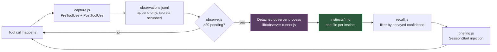

# The Context and Memory subsystem

*Last Updated: 2026-07-28*

The largest piece of executable machinery in this repo, and the reason most of `plugins/nxtlvl/lib/`
exists. It gives the harness a form of learned habit: it watches what tool calls actually happen,
distils recurring patterns into **instincts** in a background process, decays them over time, and
re-injects the strong ones at the start of the next session.

Source comments abbreviate this subsystem; the written-out name is *Context and Memory*.

## The loop



## The stages

### 1. Capture — `hooks/capture.js`

Registered on both `PreToolUse` (start of a call) and `PostToolUse` (completion), matcher `*`. Each
record is truncated to roughly 5,000 characters and passed through `lib/scrub.js` before being
appended to the observation log.

Secret scrubbing is **fail-closed** — the one place in the subsystem that is not fail-open. If
scrubbing cannot complete, the record does not get written. Everything else degrades to a no-op.

Subagent runs and the observer's own tool calls are skipped, so the loop cannot observe itself.

Kill switch: `NXTLVL_CM_CAPTURE=off`.

### 2. Trigger — `hooks/observe.js`

Runs on `PostToolUse`. When the pending observation count reaches the cadence threshold (default
**20**, override `NXTLVL_CM_OBSERVE_CADENCE`), a per-session single-flight guard spawns **one
detached** `node` process running `lib/observer-runner.js`, then returns immediately. The hook never
waits and never blocks.

The detached process calls a Claude model to do the distillation, with a default timeout of 120,000
milliseconds (`NXTLVL_CM_MODEL_TIMEOUT_MS`). The comment at `hooks/observe.js:42` notes a deliberate
margin between this and the outer timeout — keep it when changing either.

Kill switch: `NXTLVL_CM_OBSERVE=off`.

### 3. Store — `lib/instincts.js`

One Markdown file per instinct, filename `<id>.md`, with frontmatter carrying the confidence score
and timestamps. Field order is fixed so output is deterministic. Every write is atomic (temporary
file plus rename, via `lib/atomic.js`).

Project-scoped instincts live under the project's directory; global ones under a shared directory.
Project identity is the git common directory, so worktrees of one repository share their instincts.

**Confidence arithmetic** (`plugins/nxtlvl/lib/instincts.js:40-49`, `:349`):

| Constant | Value | Meaning |
|---|---|---|
| Half-life | 30 days (`NXTLVL_INSTINCT_HALFLIFE_DAYS`) | Effective confidence halves every 30 days unattended |
| Reinforce rate | 0.2 | How much a repeat sighting raises confidence |
| Maximum confidence | 0.999999 | Strict ceiling — an instinct never reaches certainty |

Effective confidence is `raw × 0.5^(ageDays / halfLife)`. An instinct that stops recurring fades out
on its own rather than needing to be deleted.

### 4. Recall — `lib/recall.js`

At session start, selects which instincts are strong enough to inject. The bar is **0.7** on
decayed confidence (`NXTLVL_CM_RECALL_BAR`). Relevance filtering and best-first sorting are delegated
to the store's `forProject` query rather than reimplemented here.

### 5. Brief — `hooks/briefing.js`

The `SessionStart` hook. Injects the "where you left off" bookmark for the current branch plus the
recalled instincts. On the post-compaction path it also uses `lib/open-files.js` to extract
recently-touched file paths from the session transcript.

### 6. Close — `hooks/close.js`

The `SessionEnd` hook. Writes the bookmark: one dated note per session, grouped by branch (falling
back to folder name when not on a branch), stored as append-only newline-delimited JSON at
`bookmarksDir/<groupKey>.jsonl`.

## Graduation — turning instincts into artifacts

`lib/evolve.js` is the clustering engine behind the `/nxtlvl:evolve` command. It applies a **strong
bar of 0.8**, normalizes triggers, clusters the survivors, and classifies each cluster into exactly
one of `agent`, `skill`, or `command`. With `--generate`, the `evolver` agent authors the artifact
into `.claude/evolved/` for review — staging, never straight into the live plugin.

`/nxtlvl:promote` lifts a project instinct to global scope, gated on the same 0.8 bar.
`/nxtlvl:prune` removes stale pending instincts that decayed below the recall bar and never recurred.

## Measurement — `lib/metrics.js`

Provides the readouts behind `/nxtlvl:instinct-status`. The north-star reliability metric is
**fallback rate** — the share of sessions that fell back to a non-nxtlvl skill, fed by the
`hooks/fallback-log.sh` `PreToolUse` hook, which logs every prefixed Skill/Task/Agent invocation.

## Storage layout

Owned entirely by `plugins/nxtlvl/lib/paths.ts`. The root is locked and lives deliberately outside
both the repo and `~/.claude`, because this is machine-local *state*, not configuration:

```
${XDG_STATE_HOME:-~/.local/state}/nxtlvl/
├── <project-id>/
│   ├── observations.jsonl
│   ├── instincts/<id>.md
│   └── bookmarks/<branch>.jsonl
└── global/instincts/<id>.md
```

Every other module is path-agnostic and asks `paths.ts` for locations. Do not hardcode a path
anywhere else.

## Safety properties

| Property | Where enforced |
|---|---|
| Fail-open everywhere except scrubbing | Each hook wraps its body and exits zero on error |
| Fail-closed secret scrubbing | `lib/scrub.js` — no scrub, no write |
| Crash-safe writes | `lib/atomic.js` — temporary file plus rename |
| No self-observation | `capture.js` and `observe.js` skip subagents and the observer |
| Single-flight distillation | Per-session guard in `observe.js` |
| Per-hook kill switches | `NXTLVL_CM_CAPTURE`, `NXTLVL_CM_OBSERVE`, `NXTLVL_DANGEROUS_BASH`, and others |

## Related

- [modules.md](./modules.md) — one line per library module
- [architecture.md](./architecture.md) — where this sits in the whole
- [patterns.md](./patterns.md) — the fail-open and atomic-write conventions in general
