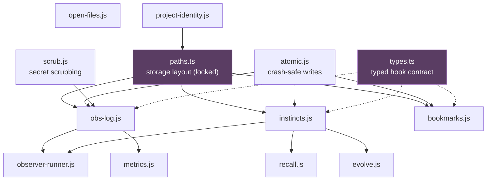

# Modules

*Last Updated: 2026-07-28*

The 13 modules in `plugins/nxtlvl/lib/`. Every one has a colocated `*.test.js` or `*.test.ts`
sibling. All are Node standard library only — no external runtime dependencies.

## Dependency shape



The two purple modules are the ones to treat carefully — changes there ripple everywhere.

## Foundation layer

| Module | Purpose | Notes |
|---|---|---|
| `paths.ts` | **Single source of truth for the on-disk storage layout.** Root is `${XDG_STATE_HOME:-~/.local/state}/nxtlvl`, deliberately outside `~/.claude` because this is machine-local state, not configuration. | Locked by decision D1. No other module hardcodes a path. |
| `types.ts` | **The platform boundary.** The typed contract for shapes crossing between Claude Code and these hooks. | Described in-file as "the migration's core value" |
| `atomic.js` | Path-agnostic write primitives — temporary file plus rename. Knows nothing about layout. | Underpins the log, instinct store, and bookmarks |
| `scrub.js` | Secret scrubbing on the write path. **Fail-closed** — the one deliberate exception to fail-open. | Productionized from an earlier spike |
| `project-identity.js` | Project identity plus branch/folder grouping keys. Identity is the git common directory, so worktrees of one repo share it. | Locked by ADR-025 |

## Storage layer

| Module | Purpose |
|---|---|
| `obs-log.js` | The append-only newline-delimited JSON observation log — one record per tool call. The durable substrate everything downstream reads. |
| `instincts.js` | The instinct store: one Markdown file per instinct, fixed frontmatter field order for deterministic output, atomic writes. Owns the confidence arithmetic (30-day half-life, 0.2 reinforce rate, 0.999999 ceiling). |
| `bookmarks.js` | The per-session "where I left off" trail. One dated note per session, grouped by branch (folder fallback off-git), append-only at `bookmarksDir/<groupKey>.jsonl`. |

## Logic layer

| Module | Purpose |
|---|---|
| `recall.js` | Quality-gated instinct recall for session start. Bar is 0.7 on decayed confidence (`NXTLVL_CM_RECALL_BAR`). Delegates relevance filtering and sorting to the store's `forProject`. |
| `evolve.js` | Deterministic instinct clustering for `/evolve`. Applies a 0.8 strong bar, normalizes triggers, clusters, and classifies each cluster as exactly one of `agent`, `skill`, or `command`. |
| `metrics.js` | Readout aggregations for `/instinct-status`. The north-star metric is fallback rate — the share of sessions that reached for a non-nxtlvl skill. |
| `observer-runner.js` | The detached process's logic. `hooks/observe.js` spawns this file as a detached `node` child once enough observations accumulate; it reads the new observations and distils instincts. |
| `open-files.js` | Extracts recently-touched file paths from a session transcript. Used by the session-start briefing on the post-compaction path. |

## Testing

Tests are colocated, one per module, and run through `node --test` — no framework. The whole suite
(plugin plus compiler) is 478 tests in about 13 seconds.

```
plugins/nxtlvl/lib/instincts.js
plugins/nxtlvl/lib/instincts.test.js    ← sits right beside it
```

## Related

- [context-and-memory.md](./context-and-memory.md) — how these modules compose into the loop
- [entry-points.md](./entry-points.md) — the hooks that call them
- [patterns.md](./patterns.md) — the conventions they all follow
