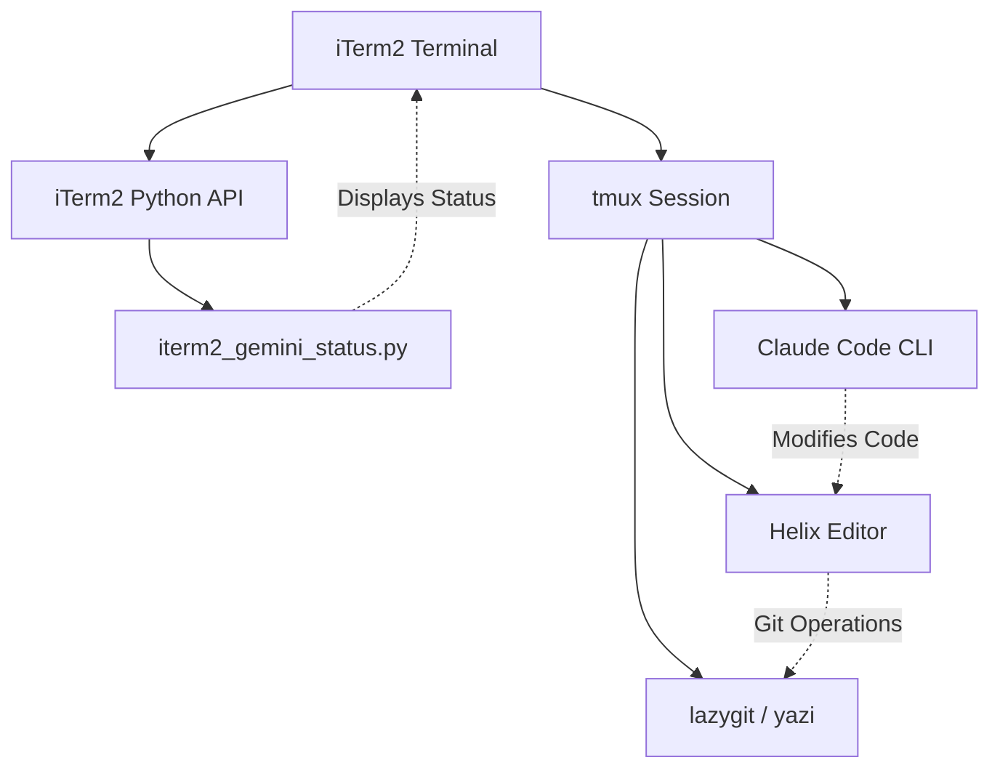

# Architecture Overview

**Analysis Date:** 2026-02-20

## System Design

The project is designed as a **Terminal-Centric Development Environment** enhancement suite. It focuses on extending the capabilities of the **iTerm2** terminal emulator on macOS, integrating it with modern development tools to create a high-velocity, AI-augmented workflow.

The architecture is modular, consisting of three primary layers:

### 1. Integration Layer (iTerm2 Python API)
This layer interacts directly with the iTerm2 application using its Python scripting API.
- **Dynamic Status Bar:** `iterm2_gemini_status.py` implements a custom status bar component. It utilizes the `iterm2` Python package to register a component that listens to terminal state changes (e.g., profile name) and provides visual feedback.
- **Asynchronous Execution:** Uses Python's `asyncio` to ensure terminal responsiveness while performing status updates.
- **Interactive Feedback:** Provides real-time status of AI-assisted sessions directly in the terminal chrome.

### 2. Workflow Orchestration Layer (tmux + Claude Code)
This layer manages the developer's session and parallel task execution.
- **Multiplexing:** **tmux** is used to manage multiple terminal panes and windows, allowing for persistent sessions and complex layouts.
- **Parallel Agents:** The architecture encourages running multiple **Claude Code** instances in parallel, each isolated within its own tmux pane or window, often leveraging **Git Worktrees** to work on different branches simultaneously without context switching overhead.
- **TUI Tooling:** Integrates **lazygit** for version control monitoring and **yazi** for filesystem navigation, providing a cohesive TUI-based IDE experience.

### 3. Execution Layer (Helix Editor + Python Scripts)
This layer is where the actual code modification and utility execution happen.
- **Modal Editing:** **Helix** provides a fast, LSP-capable editing environment that is terminal-native, fitting perfectly into the tmux/iTerm2 stack.
- **Utility Scripts:** Standalone Python scripts like `rainbow_anim.py` provide aesthetic or functional enhancements to the terminal environment, demonstrating the use of 24-bit True Color ANSI escape codes.

## Component Interaction

## Key Patterns
- **Terminal-First Philosophy:** Minimizing reliance on GUI applications in favor of high-performance TUI tools.
- **AI-Augmented Parallelism:** Leveraging multiple AI agents (Claude Code) synchronized through Git Worktrees.
- **SAND Navigation:** Adoption of the Split/Across/Navigate/Destroy pattern for efficient pane and window management in tmux.

---
*Architecture analysis: 2026-02-20*
