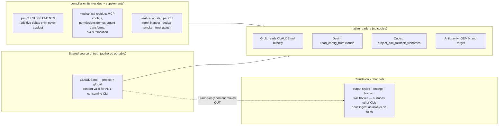

# ADR-028: Multi-CLI config: portable shared source-of-truth plus per-CLI supplements — compile the residue, never filtered instruction copies

## Context

The multi-CLI parity goal: agent configuration lives in **Claude Code format as the single
source of truth**, and compiler scripts populate the other CLIs (Grok Build CLI, Devin CLI,
Codex, Antigravity) from it. The research base is
[`docs/reference/multi-cli-config-compat.md`](../reference/multi-cli-config-compat.md), which
found all four targets ship some native Claude-compat and framed the compiler's #1 job as
emitting **filtered `AGENTS.md` copies** — CLAUDE.md with Claude-only sections stripped —
to stop Claude-only content leaking into other CLIs' instruction streams. The leak is live
today: the global `CLAUDE.md`'s sandbox guidance (`dangerouslyDisableSandbox: true`, a Claude
Code Bash-tool flag) reaches Grok's instruction stream verbatim (~1.5k tokens) and previously
reached Gemini via the `GEMINI.md → CLAUDE.md` symlink.

On 2026-07-10 the plan was adversarially cross-examined **by each target CLI's own model**
(Codex 0.144.1, Grok 0.2.93, Devin 3000.1.27, agy 1.1.1 — each grounded in its own docs and
this machine's live install; passes recorded in the compat doc). The reviews established that
instruction-file discovery semantics differ *structurally* across the four:

| CLI | Discovery semantics | Effect of emitting `AGENTS.md` beside `CLAUDE.md` |
|---|---|---|
| Codex | **Pick-one per directory** (`AGENTS.override.md` → `AGENTS.md` → fallbacks) | Safe — AGENTS.md wins, CLAUDE.md ignored |
| Grok | **Accumulate** every matching filename | Duplication *and* the leak survives via CLAUDE.md |
| Devin | **Accumulate**, no dedup; `read_config_from.claude` is all-or-nothing (no rules-only off-switch) | Duplication *and* the leak survives via CLAUDE.md |
| Antigravity | **Accumulate** — loads `GEMINI.md` *and* `AGENTS.md` both; `@file.md` imports expand (trusted-workspace probe, 2026-07-10) | Duplication *and* the leak survives via GEMINI.md |

So the filtered-copy strategy is actively harmful for three of four CLIs and
correct only for Codex. Grok's and Devin's reviews independently converged on the same
alternative: fix the shared source itself.

This decision is architectural (it defines a durable boundary — what may live in any
`CLAUDE.md`, project or global, versus Claude-only channels — that every future config change
must respect) and expensive to reverse (the compiler's emitter set, the authoring convention,
and per-repo instruction files all hang on it) — the ADR-worthy bar per
`~/.claude/rules/decisions.md` §1. The verified platform facts themselves stay in the compat
doc (the spec-tier record); this ADR records only the strategy decision they forced.

## Decision

1. **`CLAUDE.md` — project and global — is authored portable.** It contains only content
   valid for any consuming CLI. Claude-only material (sandbox flags, Claude-tool
   instructions, harness-internal mechanics) moves to channels other CLIs do not ingest as
   always-on instructions. Which channels qualify is an empirical, per-surface question
   answered by the compat doc's matrix — e.g. `.claude/rules/` does **not** qualify (Grok
   reads it), while output styles and `settings.json` do.
2. **Emitted instruction files are per-CLI supplements, never filtered copies.** A supplement
   carries only that CLI's additive deltas: Devin-specific notes in `AGENTS.md`, Grok deltas
   in `.grok/rules/`, Antigravity via the `GEMINI.md` target. With a fully portable
   CLAUDE.md, Codex needs no emitted file at all — the existing
   `project_doc_fallback_filenames = ["CLAUDE.md"]` suffices; a filtered `AGENTS.md` remains
   a Codex-only *option* (safe under its pick-one semantics), not the cross-CLI mechanism.
3. **The compiler emits only the mechanical residue** — MCP config formats, the permissions
   demux, agent transforms, skills relocation — per the compat doc's residue list, and every
   emit is paired with a **verification step** using the target CLI's own introspection
   (`grok inspect --json`; a Codex smoke run, since untrusted-repo trust gating can silently
   ignore emitted `.codex/` files), because three of four reviews surfaced ways correct
   emitted files get silently dropped.

## Alternatives Considered

### Filtered `AGENTS.md` copies (the prior direction)
- Pros: single uniform mechanism; no authoring discipline required on the source; the SoT
  stays free-form.
- Cons: double-loads on Grok and Devin (duplicated portable content, and the Claude-only
  leak survives via the still-present CLAUDE.md); not picked up by Antigravity; correct only
  for Codex.
- Rejected: three of four platform self-reviews invalidated it — two showed it makes the
  problem worse, one showed it does nothing.

### Disable native imports and emit everything
- Pros: total compiler control; no accumulate-semantics hazard; per-CLI output exactly
  tailored.
- Cons: forks the entire import pipeline per CLI (skills, agents, hooks, MCP all become
  emitters); loses the native-compat maintenance win that made the compat-first headline
  true; Devin's review priced this as the expensive branch of its all-or-nothing switch.
- Rejected: maximal maintenance for a problem the portable-SoT rule solves at the source.

### Claude-only sections left inline, marked as prose ("when using Claude Code…")
- Pros: no relocation work; zero new channels.
- Cons: still always-on token noise in every other CLI's context; Grok's review flagged the
  residual confusion risk for subagents that try to invoke nonexistent tool parameters.
- Rejected as the end state; acceptable only as a shrinking interim while content migrates.

### Portable SoT + per-CLI supplements — Adopted
- Pros: fixes the leak at its origin for every current *and future* CLI regardless of its
  discovery semantics; shrinks the compiler (no instruction-copy emitters); the two
  accumulate-semantics reviews independently recommended exactly this shape.
- Cons: imposes a permanent authoring discipline on every CLAUDE.md ("is this portable?");
  Claude-only channel placement needs per-surface care because other CLIs ingest more of
  `~/.claude/` than expected.
- Adopted: it is the only strategy consistent with all four verified discovery semantics.

## Consequences

- **Every CLAUDE.md edit now carries the portable test** — project and global, since Devin
  reads `~/.claude/CLAUDE.md` directly and Grok reads `~/.claude/` instruction files under
  its default compat. This is a candidate for a future rule-file trigger and an
  `nxtlvl:audit` check (warning-tier, per ADR-009's block-on-facts-only discipline), neither
  built yet.
- **~~The first concrete migration case is the global `## Sandbox` section~~ — MIGRATED
  (2026-07-10, same day):** diagnosis split the blanket "sandbox breaks TLS to GitHub" claim
  into a missing `api.github.com` allowlist entry (fixed — `*.github.com` added to
  `sandbox.network.allowedDomains`; unauthenticated GitHub HTTPS now works in-sandbox,
  verified) and two residual blockers for authenticated `gh`/`git push` (Go↔`trustd` TLS
  verification and macOS-keychain token reads — the keychain one left deliberately unfixed
  as a credential boundary). The `## Sandbox` sections were removed from global and
  nxtlvl-core CLAUDE.md; the residual sandbox-off-for-auth guidance now lives in the
  `cc-sandbox-blocks-keychain-auth` memory — settings + memory being the Claude-only
  channels this ADR anticipated.
- **The compiler seed (`nxtlvl-lab/scripts/sync-agent-configs.ts`) refocuses**: its
  instruction-file output becomes supplement-shaped; its residue emitters (MCP, permissions,
  agents, skills) and a per-CLI verification step become the substance. The compat doc's
  corrected per-CLI facts (Codex trust gating and exact MCP keys; Devin permission-merge and
  hook-stacking semantics; Antigravity's `~/.gemini/config/` vs `~/.gemini/antigravity-cli/`
  split) are the emitters' spec.
- **`GEMINI.md → CLAUDE.md` symlinks become correct once CLAUDE.md is portable** — the
  symlink then delivers portable content to Antigravity by construction; a compiled
  Antigravity-specific GEMINI.md is only needed if Antigravity supplements materialize.
- **~~Open verification item~~ — RESOLVED (2026-07-10):** a trusted-workspace probe
  (`agy --new-project -p`, magic-word markers) showed Antigravity loads a root `AGENTS.md`
  **and** `GEMINI.md` (accumulate, not pick-one) and expands `@file.md` imports. The earlier
  inconclusive probe was the untrusted-workspace confound. Consequences: Antigravity joins the
  load-everything column (strengthening this ADR's no-copies rationale), and the
  `GEMINI.md → CLAUDE.md` symlink forwards Claude `@import`s to Gemini until CLAUDE.md's
  imports are themselves portable-only.
- **Reviews are dated evidence.** The four self-review passes are pinned to 2026-07-10
  CLI versions; re-ground the per-CLI ingestion surfaces before major compiler work, since
  any CLI adding or removing a read path shifts what "portable" and "Claude-only channel"
  mean.
- Cross-links: [ADR-027](ADR-027-global-rules-layer-cross-project-split.md) (the global
  rules layer this discipline extends — note its rule files are themselves read by Grok, so
  they fall under the portable test); [ADR-007](ADR-007-memory-architecture.md) /
  [ADR-008](ADR-008-context-assembly.md) (Draft — memory/context-assembly ownership, whose
  eventual decisions must respect this boundary); evidence record:
  [`docs/reference/multi-cli-config-compat.md`](../reference/multi-cli-config-compat.md).
