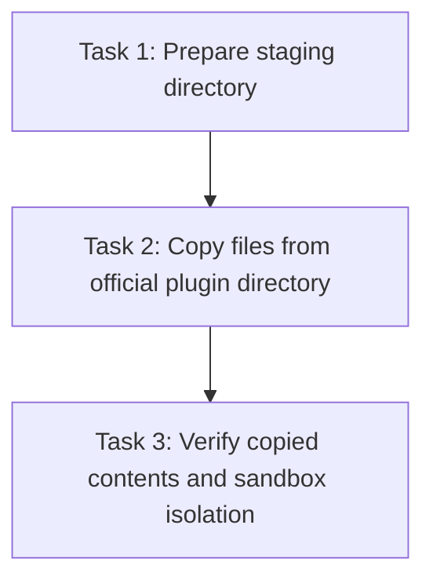

# Implementation Plan: project-artifact skill import

> Consumes [`docs/superpowers/specs/2026-07-04-project-artifact-import-design-spec.md`](../superpowers/specs/2026-07-04-project-artifact-import-design-spec.md)
> Status: **Completed**
> Date: 2026-07-04

## Overview

This plan details the steps to copy the official `project-artifact` plugin files into the `sandbox/skills/project-artifact/` directory.

## Dependency Graph

## Task List

### Task 1: Prepare staging directory

**Description:** Ensure the staging directory `sandbox/skills/project-artifact/` exists and is clean.

**Acceptance criteria:**
- [x] Directory `sandbox/skills/project-artifact/` exists.

**Verification:**
- `ls -la sandbox/skills/project-artifact/` or similar checks.

**Dependencies:** None

**Files likely touched:** None (directory creation)

### Task 2: Copy files from official plugin directory

**Description:** Copy the files from `/Users/willschaefer/.claude/plugins/marketplaces/claude-plugins-official/plugins/project-artifact/` into `sandbox/skills/project-artifact/`.

**Acceptance criteria:**
- [x] All 5 target files copied: `SKILL.md`, `swe.md`, `template.html`, `LICENSE`, `README.md`.

**Verification:**
- Verify files exist in `sandbox/skills/project-artifact/` and compare their sizes/hashes with the source files.

**Dependencies:** Task 1

**Files likely touched:**
- `sandbox/skills/project-artifact/SKILL.md`
- `sandbox/skills/project-artifact/swe.md`
- `sandbox/skills/project-artifact/template.html`
- `sandbox/skills/project-artifact/LICENSE`
- `sandbox/skills/project-artifact/README.md`

### Task 3: Verify copied contents and sandbox isolation

**Description:** Check that the copied files are correct and ensure that the running harness does not load/warn about them since they are under `sandbox/`.

**Acceptance criteria:**
- [x] MD5/SHA256 checksums match the source files exactly.
- [x] No harness startup warnings or loading of the new skill.

**Verification:**
- Run `git status` to ensure all 5 files are tracked.
- Run checksum comparison on the files.

**Dependencies:** Task 2

**Files likely touched:** None
