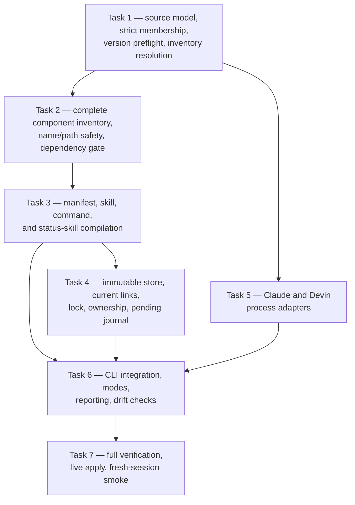

# Implementation Plan: Devin plugin parity increment 1

> Consumes [`docs/superpowers/specs/2026-07-21-devin-plugin-parity-increment-1-design.md`](../superpowers/specs/2026-07-21-devin-plugin-parity-increment-1-design.md)
> Program: [`docs/superpowers/specs/2026-07-21-devin-plugin-parity-design.md`](../superpowers/specs/2026-07-21-devin-plugin-parity-design.md)
> Status: **Draft for review**
> Date: 2026-07-21

## Overview

Extend the existing TypeScript multi-CLI compiler with a bounded plugin synchronization path. Increment 1 reads Claude's globally enabled plugin set, refreshes healthy sources, creates immutable Devin adapter snapshots for plugin identity and skill surfaces, installs absent plugin names, and verifies structural delivery. The live synchronization path does not modify Devin user configuration, MCP servers, hooks, agents, existing registrations, or target project configuration.

Implementation follows test-driven slices. Pure parsing and transformation stay separate from filesystem and subprocess orchestration. Existing compiler behavior remains green after every task.

## Architecture decisions

- Add a focused pure module instead of expanding `emitters.ts`, which already owns unrelated configuration transforms.
- Add a focused orchestration module instead of placing plugin state, locks, subprocesses, and journals directly in `compile.ts`.
- Inject filesystem roots, clock, process runner, and command output into tests. Tests never touch live Claude or Devin configuration.
- Use synthetic plugin fixtures. Do not copy third-party plugin content into the repository.
- Add no package dependency unless current enabled-plugin frontmatter cannot be parsed safely with the existing supported subset. If a parser dependency is required, add it with the package manager after checking that the selected release is at least seven days old.
- Keep live rollout separate from unit and integration verification. The expected broken `workspace-init` source makes the first live synchronization partially successful and nonzero by design.

## Dependency graph



## Task 1: Source model, strict membership, and inventory resolution

**Description:** Introduce the pure plugin synchronization data model. Parse Claude user settings with duplicate-key detection, derive exact enabled membership, validate CLI capability fixtures, parse Claude's JSON plugin inventory, and select one healthy source deterministically.

**Implementation steps:**

1. Add failing tests for missing, unreadable, malformed, duplicate-key, null, array, wrong-type, mixed-boolean, and valid membership inputs.
2. Add failing tests for healthy user-scope preference, semantic-version ordering, timestamp fallback, path fallback, source errors, and unresolved ties.
3. Add sanitized fixtures for supported and unexpected Devin list/info output plus Claude inventory output.
4. Implement the smallest pure parser and resolver that passes those tests.
5. Export explicit result types for `ok`, `blocked`, and `cannot-assess` states.

**Acceptance criteria:**

- [ ] Membership includes only exact `true` entries.
- [ ] Every malformed or ambiguous source fails closed before any action can be planned.
- [ ] Duplicate installation resolution is deterministic and independent of inventory order.
- [ ] Unsupported CLI versions or output shapes return `cannot-assess`.
- [ ] Existing compiler tests remain green.

**Verification:**

```bash
node --test scripts/multi-cli-compiler/plugins.test.ts --test-name-pattern='membership|inventory|version'
npm run typecheck
```

**Dependencies:** None.

**Files likely touched:**

- `scripts/multi-cli-compiler/plugins.ts` — new pure plugin domain module.
- `scripts/multi-cli-compiler/plugins.test.ts` — new pure unit tests.
- `scripts/multi-cli-compiler/test-fixtures/plugins/` — sanitized command-output fixtures.

## Task 2: Complete component inventory and safety gates

**Description:** Inventory every manifest key, manifest-declared path, top-level entry, skill, command, and selected symlink. Classify every entry. Enforce plugin and skill names, path containment, symlink safety, case-folding, Unicode normalization, and the increment-1 dependency-policy block.

**Implementation steps:**

1. Add synthetic plugin fixtures covering every increment-1 category plus MCP, hook, agent, documentation/license, runtime resource, cache housekeeping, other-known, and unknown entries.
2. Add failing tests for traversal, absolute paths, separators, reserved names, control characters, escaping links, cycles, broken links, case-only collisions, Unicode-equivalent collisions, and duplicate manifest names.
3. Add failing tests for each nonempty dependency-policy list.
4. Implement pure classification and path-policy functions.
5. Add filesystem-backed tests using temporary directories for real symlink containment and cycles.

**Acceptance criteria:**

- [ ] Every source entry appears exactly once in the component inventory.
- [ ] Unknown entries remain visible and block aggregate success.
- [ ] Documentation/license and known cache state remain visible but non-runtime.
- [ ] No selected path can escape the reported installation root.
- [ ] Any dependency policy blocks before Devin installation.

**Verification:**

```bash
node --test scripts/multi-cli-compiler/plugins.test.ts --test-name-pattern='component|name|path|symlink|dependency'
npm run typecheck
```

**Dependencies:** Task 1.

**Files likely touched:**

- `scripts/multi-cli-compiler/plugins.ts`
- `scripts/multi-cli-compiler/plugins.test.ts`

## Task 3: Manifest, skill, command, and status-skill compilation

**Description:** Compile one deterministic Devin adapter payload from a validated source. Preserve allowed native metadata, snapshot complete contained skill directories, convert only commands with exact Devin equivalents, and generate an honest status skill for component-only plugins.

**Implementation steps:**

1. Add failing tests for native and Claude-only manifests, metadata allowlists, unknown keys, and blocked dependency fields.
2. Add failing tests for skill frontmatter preservation, exact tool-name mapping, missing references, unavailable interpreters, escaping references, and runtime-unverified dependencies.
3. Add failing tests for supported command frontmatter, argument hints, trigger mapping, Claude-only arguments, plugin-root references, background behavior, unsupported tools, same-name divergent behavior, and generated-name collisions.
4. Add failing tests for component-only status skill names, fallback names, collisions, and truthful deferred-component content.
5. Implement deterministic adapter payload compilation.
6. Verify generated Markdown with the existing portability gate and the new runtime-token checks.

**Acceptance criteria:**

- [ ] Adapter manifests contain only documented Devin metadata.
- [ ] Skill snapshots include complete contained support files without unrelated plugin content.
- [ ] Unsupported commands are never partially rewritten.
- [ ] Generated names are deterministic, valid, and collision-free across the complete plugin skill set.
- [ ] Component-only plugins receive a status skill that does not claim to implement deferred behavior.
- [ ] No third-party fixture content is vendored into production paths.

**Verification:**

```bash
node --test scripts/multi-cli-compiler/plugins.test.ts --test-name-pattern='manifest|skill|command|status'
npm run typecheck
```

**Dependencies:** Task 2.

**Files likely touched:**

- `scripts/multi-cli-compiler/plugins.ts`
- `scripts/multi-cli-compiler/plugins.test.ts`
- `scripts/multi-cli-compiler/emitters.ts` only if the portability function needs a reusable exported extension.

## Task 4: Immutable adapter store and recovery state

**Description:** Implement the filesystem boundary under `~/.config/devin/plugin-adapters/`: content-addressed snapshots, atomic current links, write-only locking, ownership records, pending-install journals, manual-takeover detection, and crash convergence. Tests use temporary roots only.

**Implementation steps:**

1. Add integration tests for deterministic digests, immutable existing stores, corrupt claimed digests, staging, atomic current-link replacement, and retained old snapshots.
2. Add tests proving dry-run and check create no files.
3. Add tests for lock metadata, active PID, PID reuse/start-time mismatch, stale lock reporting, and no automatic stale-lock removal.
4. Add tests for first-install pending journals, successful promotion, verification failure, interrupted install, resumed verification, and missing owned registration.
5. Add tests for changed ownership fingerprints and foreign takeover.
6. Implement the adapter state store behind a narrow interface.

**Acceptance criteria:**

- [ ] Mutable Claude cache paths are never the live last-known-good adapter.
- [ ] Existing store content is never overwritten.
- [ ] Current-link changes are atomic and old snapshots remain readable.
- [ ] Dry-run and check are filesystem read-only.
- [ ] A failed or interrupted install always leaves a recoverable pending journal.
- [ ] No automatic path removes a registration, stale lock, old snapshot, or foreign state.

**Verification:**

```bash
node --test scripts/multi-cli-compiler/plugin-sync.test.ts --test-name-pattern='store|lock|ownership|pending|recovery'
npm run typecheck
```

**Dependencies:** Task 3.

**Files likely touched:**

- `scripts/multi-cli-compiler/plugin-sync.ts` — new filesystem orchestration module.
- `scripts/multi-cli-compiler/plugin-sync.test.ts` — new temporary-root integration tests.

## Task 5: Claude and Devin process adapters

**Description:** Add direct-spawn process adapters for Claude source refresh/inventory and Devin preflight/list/info/install. Keep commands as argument arrays, redact diagnostics, and make the runner injectable for tests.

**Implementation steps:**

1. Add fake-runner tests for marketplace refresh, all-enabled plugin updates, continued refresh after failures, one final inventory read, and redacted failures.
2. Add fake-runner tests for Devin version preflight, list/info parsing, foreign-name detection, missing-name detection, install invocation, and post-install verification.
3. Add tests proving plugin identifiers and paths are passed as arguments rather than shell-interpolated strings.
4. Add tests for a CLI version change immediately before registration.
5. Implement adapters with timeouts and bounded captured output.

**Acceptance criteria:**

- [ ] No source identifier, path, or plugin content enters a shell command string.
- [ ] Raw subprocess output is not included in reports.
- [ ] One plugin update failure does not suppress other updates.
- [ ] Unexpected Devin output blocks mutation as `cannot-assess`.
- [ ] Install runs only for a name proven absent and preceded by a pending journal.

**Verification:**

```bash
node --test scripts/multi-cli-compiler/plugin-sync.test.ts --test-name-pattern='Claude|Devin|process|redact|version'
npm run typecheck
```

**Dependencies:** Task 1.

**Files likely touched:**

- `scripts/multi-cli-compiler/plugin-sync.ts`
- `scripts/multi-cli-compiler/plugin-sync.test.ts`

## Task 6: CLI integration, reporting, and drift checks

**Description:** Wire `--sync-plugins` into `compile.ts` without changing existing global or repo behavior. Implement dry-run, write, and check semantics; reject `--repo`; emit the complete per-plugin and per-component report; and preserve partial healthy progress with a nonzero aggregate result.

**Implementation steps:**

1. Add command-level tests for flag validation, `--repo` rejection, dry-run, check, write, blocked-source continuation, and exit codes.
2. Add report tests for every required column and every component status.
3. Add tests proving existing global plans still run unchanged when plugin sync is absent.
4. Add tests for source and target hash changes during read-only modes.
5. Add the smallest `compile.ts` integration that delegates all plugin behavior to the new module.
6. Update the existing compiler specification with an increment-6 implementation pointer after behavior is verified; do not duplicate this plan.

**Acceptance criteria:**

- [ ] Existing invocations are byte-for-byte unchanged without `--sync-plugins`.
- [ ] `--sync-plugins --repo` fails before writes.
- [ ] Dry-run and check write nothing.
- [ ] Write applies all healthy adapters while preserving a nonzero result for blocked or unsupported items.
- [ ] Every enabled plugin and discovered component appears in deterministic report order.
- [ ] Reports contain no credentials, raw command output, or authentication-path content.

**Verification:**

```bash
npm test
npm run typecheck
npm run compile-multi-cli -- --sync-plugins
```

**Dependencies:** Tasks 3–5.

**Files likely touched:**

- `scripts/multi-cli-compiler/compile.ts`
- `scripts/multi-cli-compiler/plugin-sync.ts`
- `scripts/multi-cli-compiler/plugin-sync.test.ts`
- `docs/spec/nxtlvl-multi-cli-compiler.md`

## Task 7: Full verification and live rollout

**Description:** Verify all automated gates, inspect the live dry-run, apply healthy adapters to the user's Devin installation, confirm expected partial failure for broken or unsupported sources, run drift checks, and perform a fresh-session low-side-effect smoke.

**Implementation steps:**

1. Run the full tests and typecheck.
2. Run dry-run and review all fourteen enabled-plugin rows before writes.
3. Confirm the report identifies `workspace-init` as blocked and every deferred MCP, hook, agent, and other component explicitly.
4. Run write mode. Healthy adapters install even though the aggregate process may exit nonzero.
5. Run check mode and distinguish expected source/component blockers from adapter drift.
6. Run `devin plugins list` and `devin plugins info <name>` for every healthy installed plugin.
7. Start a fresh Devin process and invoke one low-side-effect skill per skill-bearing plugin plus every generated status skill.
8. Record actual versions, delivered plugins, blocked plugins, unsupported commands, runtime-unverified items, and restart status in the increment specification's implementation note.
9. Commit only the implementation and its specification/plan updates with explicit staging.

**Acceptance criteria:**

- [ ] `npm test` passes.
- [ ] `npm run typecheck` passes.
- [ ] Dry-run writes nothing.
- [ ] Every healthy, increment-1-installable enabled plugin receives an adapter and registration.
- [ ] Every healthy but non-installable plugin has a precise blocking reason.
- [ ] `workspace-init` remains blocked without stale content being installed.
- [ ] Every registry skill inventory matches its immutable snapshot.
- [ ] Check reports no adapter, ownership, link, or registry drift.
- [ ] Fresh-session discovery succeeds for every low-side-effect smoke target.
- [ ] The live sync modifies no existing Devin registration, user config, MCP server, hook, agent, or target project configuration.

**Verification:**

```bash
npm test
npm run typecheck
npm run compile-multi-cli -- --sync-plugins
npm run compile-multi-cli -- --sync-plugins --write
npm run compile-multi-cli -- --sync-plugins --check
devin plugins list
```

Expected blocked sources or deferred full-program components are documented separately from implementation failures. A nonzero aggregate exit is acceptable only when every nonzero row is expected, explicit, and accompanied by healthy-adapter success.

**Dependencies:** Task 6.

**Files likely touched:**

- `docs/superpowers/specs/2026-07-21-devin-plugin-parity-increment-1-design.md`
- `docs/spec/nxtlvl-multi-cli-compiler.md`
- Compiler implementation and test files from Tasks 1–6.
