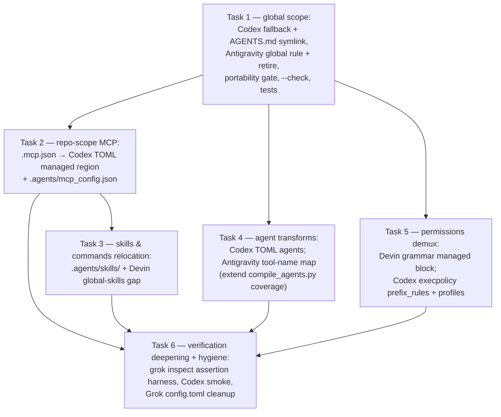

# Implementation Plan: multi-CLI config compiler

> Consumes [`docs/spec/nxtlvl-multi-cli-compiler.md`](../spec/nxtlvl-multi-cli-compiler.md)
> Status: **Tasks 1–3 built and verified (Task 1 applied 2026-07-11; Tasks 2–3 built,
> applied, and sentinel-probed 2026-07-12); `--check` reports all targets in sync.
> Tasks 4–6 queued.**
> Date: 2026-07-11 · Updated: 2026-07-12

## Overview

Build the ADR-028 compiler in increments, global scope first (the highest-value gaps on this
machine: Codex reads nothing in `AGENTS.md`-less repos, and Antigravity's global rules are a
stale July-4 hand conversion carrying the sandbox leak), then repo scope, then the heavier
transforms. Every increment ships with its verification, per ADR-028's
every-emit-paired-with-verification requirement.

## Architecture decisions

All in the spec and ADR-028. Sequencing-relevant only: repo-scope work (Task 2 onward) must
not break `nxtlvl-lab`'s existing `stack.toml` flow — the lab seed keeps working until the
generalized compiler replaces it, then the seed's repo-local outputs migrate.

## Dependency graph

## Task 1: Global-scope compiler (Codex + Antigravity emitters) — **BUILT + APPLIED 2026-07-11**

**Description:** `scripts/multi-cli-compiler/` with dry-run/`--write`/`--check` modes, the
managed-TOML-region contract, the portability gate, backups, and the retire list. Emits:
Codex `project_doc_fallback_filenames = ["CLAUDE.md"]` (managed region in
`~/.codex/config.toml`), `~/.codex/AGENTS.md → ~/.claude/CLAUDE.md` symlink, and the
`~/.gemini/GEMINI.md → ~/.claude/CLAUDE.md` symlink; retires the five 2026-07-04
hand-converted rule copies plus the transitional compiled `global-conventions.md`.

**Revision note (same day):** the first build compiled an always-on
`global-conventions.md` rule into `~/.gemini/config/agents/` and applied it. A follow-up
sentinel probe showed that directory is **never read** (nothing loads files there), while
`~/.gemini/GEMINI.md` loads always-on — so the emit was revised to the symlink and the
compiled rule joined the retire list. The revised emits were applied 2026-07-11 (2 changes,
backups under `compiler-backup-workspace/2026-07-12T01-53-26-294Z/`); `--check` exits zero.

**Acceptance criteria:**
- [x] Unit tests pass (`npm test`); typecheck clean (`npm run typecheck`)
- [x] Dry run prints the plan and writes nothing (verified 2026-07-11: 8 changes planned,
      portability gate passed, retire guard validated all five hand conversions)
- [x] `--write` applies with backups; immediate `--check` exits zero (applied by the user
      2026-07-11 after the permission classifier required explicit consent; 8 changes,
      backups under `compiler-backup-workspace/2026-07-11T18-45-31-044Z/`; `--check` exit 0)
- [x] Manual smoke (2026-07-11): Codex `exec` probe in an `AGENTS.md`-less directory returned
      the sentinel from CLAUDE.md *and* the global file's first heading through the symlink;
      `~/.gemini/config/agents/` holds only the compiled rule (retired five absent —
      Antigravity's rule discovery is directory-based, a claim the later sentinel probe
      refuted; see the revision note); `grok inspect` stream unchanged
      (global + project CLAUDE.md pair, nothing new)
- [x] Revised apply (2026-07-11): `--write` created the `~/.gemini/GEMINI.md` symlink and
      retired the compiled `global-conventions.md` (2 changes, backed up); immediate
      `--check` exits zero
- [x] Revised smoke (2026-07-11): a trusted-workspace Antigravity probe with tools forbidden
      quoted the global CLAUDE.md "Plain language" section and its rule-file path — content
      reachable only through the `GEMINI.md` symlink; `~/.gemini/config/agents/` is empty

**Verification:** `npm test`, `npm run compile-multi-cli -- --check`, the three smoke checks
in the spec §Verification.

**Dependencies:** None.

**Files likely touched:** `scripts/multi-cli-compiler/{compile,emitters,emitters.test}.ts`,
`package.json`, `tsconfig.json`.

## Task 2: Repo-scope MCP emitters — **BUILT + VERIFIED 2026-07-12**

**Description:** Per-repo run mode: read `<repo>/.mcp.json` (+ `.claude/settings.json`
`mcpServers`), emit the Codex `[mcp_servers.X]` managed region in `<repo>/.codex/config.toml`
(exact keys per compat doc: stdio `command/args/env_vars`, HTTP
`url/bearer_token_env_var/http_headers`) and `<repo>/.agents/mcp_config.json` (the neutral
location Antigravity's workspace MCP reads). Devin and Grok need no MCP emitter (native).
First real input: `nxtlvl-lab/.mcp.json` (deepwiki).

**Acceptance criteria:**
- [x] nxtlvl-lab's deepwiki server reaches Codex and Antigravity workspace config from
      `.mcp.json` alone (2026-07-12: the compiled `.agents/mcp_config.json` is byte-identical
      to the lab seed's live file, and the seed-owned `.codex/config.toml` passes the
      delivery assertion — see build notes)
- [x] The lab's `stack.toml` flow still passes its own `--check` (run 2026-07-12, green)

**Build notes (2026-07-12):**
- `--repo <path>` (repeatable) compiles that repo's MCP servers on top of the global plan;
  sources are the union of `.mcp.json`, `.claude/settings.json`, and
  `.claude/settings.local.json`, later files winning per server name.
- A seed-owned `.codex/config.toml` (the lab's `stack.toml` flow stamps a "Generated from"
  header) is never rewritten — that flow regenerates the file whole and would silently erase
  a foreign managed block. The compiler asserts delivery instead (a `verify` action); a
  missing server reports `conflict` and is fixed in `.agents/stack.toml`, not by the compiler.
- Antigravity stdio servers are deliberately not emitted until their `mcp_config.json` key
  shape is probe-verified; HTTP servers use `serverUrl` (byte-compatible with the lab seed).
- Sentinel probes (2026-07-12), per ADR-028's every-emit-paired-with-verification rule: a
  scratch repo compiled from `.mcp.json` alone, then each CLI asked to list its MCP servers.
  Codex (scratch temporarily trusted) returned the sentinel server from the emitted managed
  block — repo-local `[mcp_servers.X]` loads; nuance: Codex normalizes server names
  (`nxtlvl-probe-deepwiki` → `nxtlvl_probe_deepwiki`). Antigravity (`agy --new-project`)
  returned the sentinel from the emitted `.agents/mcp_config.json`. Both emit targets are
  empirically confirmed; probe workspace and the temporary Codex trust entry were removed
  after the runs.

**Dependencies:** Task 1.

## Task 3: Skills & commands relocation — **BUILT + APPLIED + VERIFIED 2026-07-12**

**Description:** Symlink/copy skills to `.agents/skills/` (the pinned neutral location) per
repo, and close Devin's global-skills gap (`~/.claude/skills/` is not natively imported —
relocate into `~/.config/devin/skills/` or `~/.agents/skills/`). Avoid same-name collisions
(undefined behavior in Devin).

**Acceptance criteria:**
- [x] Global: every `~/.claude/skills/` skill gets a `~/.agents/skills/<name>` symlink
      (applied 2026-07-12 — one real skill, `brainstorming`; the empty `learned/` dir is
      skipped with a visible NOTE)
- [x] Repo scope: `--repo` relocates `<repo>/.claude/skills/` into `<repo>/.agents/skills/`
      as **relative** symlinks (they survive cloning); nxtlvl-lab needed no writes — its
      skills already live in `.agents/skills/` behind reverse-direction symlinks (build notes)
- [x] Sentinel probes all green (2026-07-12): Devin and Codex quoted the global sentinel
      through `~/.agents/skills/`; Codex (in an **untrusted** repo) and Antigravity quoted
      the repo sentinel through the workspace relative symlink
- [x] Collision guard unit-tested (`classifyAgentsSkillEntry`); the migrate path
      (byte-identical copy → symlink, original backed up) exercised live in the scratch repo
- [x] `npm test` and `npm run typecheck` pass; `--check` (global + `--repo nxtlvl-lab`)
      exits zero after apply

**Build notes (2026-07-12):**
- **Link direction:** ADR-028 makes the Claude config the source of truth, so links point
  from `.agents/skills/` into `.claude/skills/` — the reverse of the agentskills.io
  installer convention nxtlvl-lab already uses (real directories in `.agents/skills/`,
  Claude-side symlinks into them; `~/.agents/.skill-lock.json` is that installer's state).
  The compiler recognizes the reverse arrangement as *already relocated* and asserts
  delivery (a `verify` action, like the seed-owned Codex file in Task 2) instead of
  restructuring another flow's layout.
- **Collision guard:** only an empty slot or a byte-identical relocation copy is ever
  (re)placed; any foreign same-name entry reports `conflict` and is never touched —
  same-name collisions are undefined behavior in Devin (compat doc).
- **New compat facts from the probes:** Codex reads workspace `.agents/skills/` in an
  untrusted repo — skills discovery is **not** trust-gated, unlike `.codex/` config — and
  Codex, Devin, and Antigravity all follow the relocation symlinks.
- **Commands:** no `.claude/commands/` source exists anywhere on this machine, so the
  command → skill transform stays unbuilt; if command files ever appear the compiler emits
  a loud WARN rather than skipping them silently.
- **Portability gate:** markdown of every skill the compiler relocates is swept for
  Claude-only tokens (it is instruction content delivered to other CLIs); pre-existing
  reverse-direction arrangements are asserted, not swept — the gate governs what the
  compiler itself emits.
- **Deliberate gap:** Antigravity *global* skills (`~/.gemini/config/skills/`) are not
  emitted — that path is documented but unprobed, and no need exists yet; workspace skills
  cover the Antigravity story.

**Dependencies:** Task 2 (shares the repo-scope run mode).

## Task 4: Agent transforms — **BUILT + APPLIED 2026-07-12**

**Description:** Claude agents → Codex `.codex/agents/*.toml` (top-level
`name/description/developer_instructions`; `tools:` allowlist degrades to
`sandbox_mode = "read-only"` + restated discipline, per compat doc item 4) and → Antigravity
markdown with the tool-name map, extending `nxtlvl-wiki/scripts/compile_agents.py` coverage
with the orchestration tools (`invoke_subagent`, `manage_task`, `call_mcp_tool`, …).

**Dependencies:** Task 1.

**Build notes (2026-07-12):** The compiler discovers each repo's
`.claude/agents/*.md`, parses its frontmatter, and emits managed target files only when the
slot is empty or already compiler-generated. A user-authored target is a conflict, never an
overwrite. Codex receives `.codex/agents/<name>.toml` with top-level
`name`/`description`/`developer_instructions`; an edit-free Claude tool allowlist degrades to
`sandbox_mode = "read-only"`, and every target restates the intended tool discipline.
Antigravity receives `.agents/agents/<name>/agent.md` with mapped tool names; the map now
covers the orchestration tools as well as `exec` → `run_command`.

Applied to `nxtlvl-lab`'s `plan-executor` agent and passed the compiler drift check. The
official Antigravity target path is now recorded in the compat reference; live selected-agent
execution remains part of Task 6's smoke-test work because `agy agents` lists its global
catalog rather than workspace agents.

## Task 5: Permissions demux — **BUILT + APPLIED 2026-07-13**

**Description:** Claude `permissions` → Devin `Exec()/Read()/Write()/Fetch()` grammar in a
compiler-owned Devin project config (Devin ignores Claude-format entries today — ghost entries);
Codex → Starlark `prefix_rule()` execpolicy files in `.codex/rules/` (literal prefixes with
`justification` + examples, validated via `codex execpolicy check`) and `[permissions.<name>]`
profiles, keeping `sandbox_mode` out of every loaded layer. Grok gets **no** permission
emitter — an emitted `[permission]` TOML silently shadows its Claude-settings fallback.

**Acceptance criteria:**
- [x] Repo settings and local settings permissions are unioned; supported Claude grants compile
      into a compiler-owned `.devin/config.json`, leaving `.devin/config.local.json` for local
      overrides.
- [x] Safe literal `Bash(...)` grants compile into `.codex/rules/nxtlvl-permissions.rules`
      with a decision, justification, and matching/non-matching examples; `codex execpolicy
      check` validates the generated rule.
- [x] Literal file and `domain:` fetch grants compile to a Codex `nxtlvl_portable` profile that
      extends `:workspace`; legacy `sandbox_mode` blocks the profile instead of silently
      disabling it.
- [x] Claude-only, ambiguous, and prompt-only profile grants produce a clear warning and are
      not guessed; Grok gets no permission output.

**Build notes (2026-07-13):** The core repo now compiles its allowed Claude settings into a
Devin `Read` grant, a Codex read profile for `~/.claude`, and a literal `python3 -m json.tool`
rule. `npm test` passes 476 tests, `npm run typecheck` passes, the generated rule returns
`allow` from `codex execpolicy check`, and an immediate compiler `--check --repo .` is clean.
The source's `Skill(update-config)` grant and a shell command containing embedded program code
are explicitly warned and skipped because neither has a lossless target representation.

**Dependencies:** Task 1.

## Task 6: Verification deepening + hygiene sweep

**Description:** Automate the per-CLI smoke checks (a `grok inspect --json` assertion harness;
a scripted Codex smoke run for trust gating), then the remaining hygiene: delete Grok's
malformed `[[marketplace.sources]]` entry (self-review verdict: safe), thin the redundant
plugin-enable aliases in `~/.grok/config.toml`.

**Dependencies:** Tasks 2–5 (verifies their emits).
