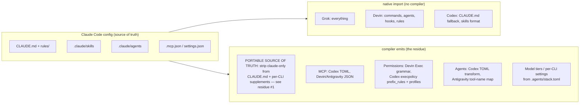

# Multi-CLI config compat — what to compile vs. what the CLIs already read

**Date:** 2026-07-10 · **Status:** verified against harvested docs (Codex 2026-06-30, Devin CLI
2026-06-28) + live installed configs; load-bearing claims **re-grounded 2026-07-10 via Context7**
against official docs (citations inline, marked CITE); each CLI's claims additionally
**adversarially reviewed by that CLI's own model** (Codex 0.144.1, Grok 0.2.93, Devin 3000.1.27,
agy 1.1.1 — all 2026-07-10; corrections folded in, passes recorded below). Feeds the "compiler
scripts populate the other CLIs from the Claude Code config" decision.

**Headline: compat-first.** All four target CLIs ship some level of native Claude Code
compatibility. The compiler should lean on native import and compile only the residue —
plus solve the one problem no native path solves: **filtering Claude-only content out of
shared instructions.**

## Native Claude-compat matrix

| Surface | Grok Build CLI | Devin CLI | Codex | Antigravity (Gemini) |
|---|---|---|---|---|
| CLAUDE.md (project) | ✅ native | ✅ native (rules file) | ✅ via `project_doc_fallback_filenames` | ✅ via `GEMINI.md → CLAUDE.md` symlink |
| CLAUDE.md (global) | ✅ native | ✅ reads `~/.claude/CLAUDE.md` directly | ❌ needs `~/.codex/AGENTS.md` | ❌ needs rules conversion |
| Skills | ✅ `.claude/skills` native | ⚠️ own dirs, but reads `.agents/skills` std | ⚠️ same `SKILL.md` format, reads `.agents/skills` std | ⚠️ `agy plugin import claude` (one-shot) |
| Agents/subagents | ✅ `.claude/agents` native | ✅ `.claude/agents` native (tools↔allowed-tools auto) | ❌ TOML format — real transform | ❌ tool-name map (compile_agents.py) |
| Hooks | ✅ plugin hooks.json native | ✅ Claude format from `.claude/settings.json` | ⚠️ near-identical schema, different file + hash-trust | ⚠️ plugin-level `hooks.json` (pre/post tool events) |
| MCP servers | ✅ `.claude.json`/`.mcp.json` native | ✅ imported from `.mcp.json` + `.claude/settings.json` | ❌ TOML `[mcp_servers.X]` | ❌ own `mcp_config.json` |
| Permissions | ⚠️ `.claude/settings.json` fallback — any TOML `[permission]` shadows it (live-verified) | ❌ own `Exec()/Read()/Write()/Fetch()` grammar | ❌ demux into 3 surfaces (see below) | ❌ own `command()/read_file()/write_file()/mcp()` grammar |
| Commands | ✅ plugin commands native | ✅ `.claude/commands/**/*.md` imported as skills | ⚠️ custom prompts **deprecated → compile to skills** | ⚠️ import converts commands → skills |

Key mechanisms: Grok — live auto-discovery each session; `~/.grok/claude_import_state.json` is
only Ctrl+I "Import Claude settings" state, **not** a drift tracker — validate with
`grok inspect` instead (Grok self-review correction).
Devin — `read_config_from.claude` (default true; enabled on this machine;
`~/.config/devin/config.json` is the CLI home, **not** `~/.devin/` which is Devin Desktop).
Codex — first-party import exists but is a **ChatGPT desktop-app onboarding flow** (Settings →
Import), one-time bootstrap, not a re-runnable CLI sync; hook env vars are
`PLUGIN_ROOT`/`PLUGIN_DATA` with `CLAUDE_PLUGIN_*` compat aliases.
Antigravity — `agy plugin import claude` (**one-shot migration**, not re-runnable sync —
continuous compile must emit directly into `~/.gemini/config/plugins/`).

## The compiler's real residue

1. **Filtered instructions — the #1 job.** Every native path shares CLAUDE.md *verbatim*, so
   Claude-only content leaks: `~/.gemini/config/agents/global-conventions.md` told
   Gemini to pass `dangerouslyDisableSandbox: true` (a Claude Code Bash-tool flag) — retired
   2026-07-11 by the compiler; a same-day sentinel probe showed nothing ever read that
   directory anyway. Fix = tag
   sections in the source (portable vs claude-only) and compile filtered `AGENTS.md` /
   Antigravity rules. Codex caps combined project docs at 32 KiB (`project_doc_max_bytes`
   default; this repo pins 65536) — filtering also keeps us under it.
   **Rollout (Codex self-review):** emit filtered `AGENTS.md` *while keeping*
   `project_doc_fallback_filenames = ["CLAUDE.md"]` as a bridge — discovery loads **at most one
   file per directory** (`AGENTS.override.md` → `AGENTS.md` → fallbacks), so the pair can't
   double-load; drop the fallback only after generated AGENTS is proven in every target repo.
   **⚠ Grok contradiction (Grok self-review):** Grok loads **every** matching instruction file
   per directory — `AGENTS.md` + `CLAUDE.md` *both* load, so an emitted AGENTS.md beside
   CLAUDE.md means duplicated portable content *and* the Claude-only leakage survives via
   CLAUDE.md. **Devin confirms the same accumulate semantics** (both load, no dedup;
   `read_config_from.claude` is all-or-nothing — no rules-only off-switch). **Antigravity
   accumulates too** — the 2026-07-10 trusted-workspace probe loaded `GEMINI.md` *and*
   `AGENTS.md` both AND expanded `@file.md` imports, refuting its own self-review's
   GEMINI.md-only claim (probe > model self-report; see the Antigravity pass below).
   **Settled strategy (Codex is the only pick-one):** make the shared source of truth itself portable —
   strip Claude-only content out of CLAUDE.md (project *and* global, since Devin and Grok read
   both) into Claude-only channels — and demote emitted files to per-CLI *supplements*:
   Devin-specific notes in AGENTS.md, Grok deltas in `.grok/rules/`, Antigravity via the
   GEMINI.md symlink/compile target. If CLAUDE.md is fully portable, Codex needs no AGENTS.md
   either — the existing fallback suffices; filtered-AGENTS.md-as-replacement survives only as
   a Codex option, not the cross-CLI mechanism.
2. **MCP emitters.** Claude `mcpServers` → Codex `[mcp_servers.X]` TOML (stdio:
   `command/args/cwd/env/env_vars`; HTTP: `url/bearer_token_env_var/http_headers/env_http_headers`)
   and Antigravity `mcp_config.json`. Preserve Codex tool controls when the source expresses them:
   `enabled_tools` / `disabled_tools` / `default_tools_approval_mode` / per-tool
   `mcp_servers.<id>.tools.<tool>.approval_mode`. Devin needs **no emitter** — it imports MCP
   servers from `.mcp.json`/`.claude/settings.json` natively (CITE above).
3. **Permissions demux.** Claude's one `permissions` block splits per target:
   Devin `Exec(prefix)` / `Read(glob)` / `Write(glob)` / `Fetch(…)` — deny > ask > allow across
   *all* merged levels (a user-level deny survives a project-level allow); bare tool-name
   perms (`"exec"`, `"edit"`, `"read"`, …) exist with no Claude analog; `WebFetch()` →
   `Fetch()` needs real WHATWG URL Pattern / `domain:` translation, not a rename;
   Codex **three** surfaces — `Bash(...)` → Starlark `prefix_rule()` execpolicy in
   `.codex/rules/` (generate literal prefixes only, always with `justification` plus
   `match`/`not_match` examples; validate via `codex execpolicy check`), file/network →
   `[permissions.<name>]` profiles (**beta**), MCP → the exact keys in item 2 above.
   Profiles lose to any loaded `sandbox_mode`/`sandbox_workspace_write` — from any config
   layer, `--sandbox` flag, or config profile; the exclusion trigger is the sandbox settings,
   **not** `approval_policy` (Codex self-review correction). Pick profiles and keep
   `sandbox_mode` out of every loaded layer — except per-agent files, where it's the
   deliberate degradation (item 4).
4. **Agent transforms.** Codex agents are TOML (`.codex/agents/*.toml`, **top-level keys** —
   `name`/`description`/`developer_instructions`, no `[agent]` wrapper; body →
   `developer_instructions`). Claude's `tools:` allowlist is an **explicitly lossy**
   translation — no Codex analog for built-in tools. Best degradation:
   `sandbox_mode = "read-only"` for no-edit agents + per-agent `mcp_servers` trimming
   (or `[[skills.config]]` disabling) + restate the intended tool discipline in
   `developer_instructions`. Antigravity agents live at
   `.agents/agents/<name>/agent.md` (a flat `.agents/agents/<name>.md` is not discovered)
   and keep markdown but need the tool-name map
   (`compile_agents.py` prior art) — the map must cover Antigravity's orchestration/system
   tools too (`invoke_subagent`, `manage_task`, `schedule`, `call_mcp_tool`, `ask_permission`,
   `define_subagent`, …); the previously-captured read/write tool list was incomplete (agy
   self-review).
5. **Skills = relocation, not transform.** `SKILL.md` is the shared agentskills.io standard.
   Codex, Devin, **and Antigravity** all read the neutral `.agents/skills/` workspace location →
   symlink/copy skills once there; Grok and Devin read `.claude/skills` natively too. Claude
   *commands* also converge on skills: Devin imports them as skills, Antigravity's import
   converts them to skills, and Codex deprecated custom prompts in favor of skills.
   **Pin `.agents/skills/` deliberately** — Codex's own docs conflict (current skills page says
   `.agents/skills`; older changelog says `.codex/skills`), so the compiler picks one layout
   rather than assuming all Codex surfaces agree.
   **Sentinel-probed 2026-07-12 (increment 3):** per-skill *symlinks* in `.agents/skills/`
   are followed by all three consumers — Codex and Devin returned a global sentinel through
   `~/.agents/skills/<name> → ~/.claude/skills/<name>`, and Codex and Antigravity returned a
   repo sentinel through a workspace-relative `../../.claude/skills/<name>` link. Notable:
   `~/.agents/` is also the agentskills.io installer's home (`.skill-lock.json`), and that
   installer uses the **reverse** direction (real dirs in `.agents/skills/`, agent-dir
   symlinks into them — nxtlvl-lab's arrangement); both directions deliver identically.
6. **Trust gating — emitted files can be silently ignored (Codex).** In untrusted repos Codex
   skips repo-local `.codex/` config, hooks, and rules entirely; non-managed hooks are
   hash-gated until a human reviews them, and plugin hooks are not auto-trusted. The compiler
   therefore needs a **verification step** (e.g. a smoke `codex exec` that echoes loaded
   config), not just a write step. Adjacent surfaces the plan doesn't cover yet:
   parent-directory `.codex/` Team Config layering and enterprise `requirements.toml`
   overrides. **Nuance (sentinel probe 2026-07-12):** workspace `.agents/skills/` is **not**
   trust-gated — Codex loaded a skill through its relative symlink in a deliberately
   untrusted scratch repo; the gate covers `.codex/`-resident surfaces.

## Prior art already in the repos

- `nxtlvl-lab/scripts/sync-agent-configs.ts` (711 lines, TS) — `.agents/stack.toml` →
  `AGENTS.md` shim, `.mcp.json`, `.codex/config.toml`, `.devin/config.local.json`,
  `.grok/settings.json`, `.gemini/settings.json`, plugin.json. Model tiers + permission
  profiles + MCP targeting. **The seed to generalize.**
- `nxtlvl-wiki/scripts/compile_agents.py` — Claude→Antigravity agent tool-name map.
- ~~Hand conversions in `~/.gemini/config/agents/` — rules with `trigger:` frontmatter,
  unfiltered (the leak exhibit).~~ Retired 2026-07-11 by the compiler; the sentinel probe
  showed that directory is never read, so they had never loaded at all.
- `GEMINI.md → CLAUDE.md` symlinks in all three sub-repos; Codex `project_doc_fallback_filenames`.

## Do NOT compile

- **Codex memories** (`~/.codex/memories/`) — generated session state, treated as read-only by
  convention (the Codex self-review found no first-party doc *forbidding* external writes, but
  none blessing them either); durable guidance goes to AGENTS.md.
- **C&M instincts/bookmarks, output styles, statusline** — Claude-harness-only; the moat, not config.
- **Devin Knowledge/Playbooks** — no CLI surface yet ("not yet supported"); cloud auto-ingests
  committed CLAUDE.md/AGENTS.md anyway.

## Context7 verification pass (2026-07-10) — closures & corrections

Grounded via `/websites/developers_openai_codex`, `/websites/devin_ai`,
`/google-gemini/gemini-cli`, `/websites/antigravity_google_cli`, `/websites/code_claude`.

**Confirmed (CITE):**
- Codex AGENTS.md discovery + `project_doc_fallback_filenames` + `project_doc_max_bytes`
  default 32 KiB — https://developers.openai.com/codex/guides/agents-md,
  https://developers.openai.com/codex/config-sample
- Codex MCP `[mcp_servers.X]` (stdio `command/args/env_vars`; HTTP
  `url/bearer_token_env_var/http_headers`) — https://developers.openai.com/codex/mcp.
  **Repo-local confirmed by sentinel probe (2026-07-12):** `[mcp_servers.X]` inside the
  compiler's managed region of a trusted repo's `.codex/config.toml` loads live; Codex
  normalizes server names in its tool namespace (`nxtlvl-probe-deepwiki` →
  `nxtlvl_probe_deepwiki`), so don't grep session output for the hyphenated name.
- Codex subagent TOML (`name/description/developer_instructions`) —
  https://developers.openai.com/codex/subagents. The `[agent]` table header seen in one snippet
  is **resolved**: current subagents docs show top-level keys, no wrapper (Codex self-review
  2026-07-10) — generate top-level.
- Codex `prefix_rules` (token/`any_of`, `prompt|forbidden`, merges with `.rules`, most
  restrictive wins) — https://developers.openai.com/codex/enterprise/managed-configuration
- Devin `read_config_from.claude`: imports rules (CLAUDE.md project+global), skills
  (`.claude/skills/**/SKILL.md`), commands (`.claude/commands/**/*.md` → skills), **and MCP
  servers from `.mcp.json` + `.claude/settings.json`** —
  https://docs.devin.ai/cli/reference/configuration/read-config-from
- Devin `Exec()` semantics: **command-prefix, must match as a complete word**; deny > ask >
  allow — https://docs.devin.ai/cli/reference/permissions
- Devin global rules `~/.config/devin/AGENTS.md`; reads `~/.claude/CLAUDE.md` as a global
  rule — https://docs.devin.ai/cli/extensibility/rules
- Gemini CLI context file override is **nested `context.fileName`** (string or array, e.g.
  `["AGENTS.md","GEMINI.md"]`) — https://github.com/google-gemini/gemini-cli/blob/main/docs/cli/gemini-md.md
- **GEMINI.md follows `@file.md` imports** (relative + absolute) — same URL. Consequence: the
  Claude `@import` indirection trick does NOT hide claude-only content from Gemini while
  `GEMINI.md → CLAUDE.md` symlinks exist. **Scope note (agy self-review):** this is *Gemini
  CLI* behavior — Antigravity's GEMINI.md does **not** follow `@file.md` imports; the
  consequence applies only where legacy Gemini CLI reads the symlink.
- Antigravity reads `GEMINI.md` **or `AGENTS.md`** at workspace root —
  https://antigravity.google/docs/cli/best-practices — **but the agy self-review contradicts
  the AGENTS.md half** (says only GEMINI.md is picked up; verify empirically before relying);
  workspace skills in `.agents/skills/`, global in ~~`~/.gemini/antigravity-cli/skills/`~~
  **corrected to `~/.gemini/config/skills/`** (agy self-review — `antigravity-cli/` is app
  data, not user config) — https://antigravity.google/docs/cli/plugins;
  permissions grammar `command()/read_file()/write_file()/read_url()/mcp()/unsandboxed()` in
  settings.json — https://antigravity.google/docs/cli/permissions; plugins carry `hooks.json`
  (pre/post tool events) — https://antigravity.google/docs/cli/plugins
- Claude Code `@path` imports: expanded at launch, relative+absolute, **recursive to 4
  levels**, backticks suppress — https://code.claude.com/docs/en/memory
- **Codex custom prompts are DEPRECATED in favor of skills** —
  https://developers.openai.com/codex/changelog. Claude commands compile to Codex *skills*.

**Formerly unverified — all four items closed by the 2026-07-10 self-review passes (below):**
1. ~~Antigravity rules `trigger:` frontmatter~~ — **confirmed** by the agy self-review:
   markdown + YAML frontmatter (`trigger: always_on|model_decision`, `description:`); global
   rules in ~~`~/.gemini/config/agents/`~~, plugin rules in
   `~/.gemini/config/plugins/<name>/rules/`. **Location correction (2026-07-11 sentinel
   probes):** `~/.gemini/config/agents/` is **never read** — files there load nothing,
   always-on or otherwise (another self-review claim refuted by probe). `~/.gemini/config/rules/`
   *does* load, and `~/.gemini/GEMINI.md` loads always-on (the compiler now symlinks it to
   the global CLAUDE.md).
2. ~~Codex `/import`, memories dir, hooks event list, permission-profile/sandbox_mode mutual
   exclusion~~ — **closed** by the Codex self-review pass: import reclassified as
   desktop-app bootstrap, hooks event list + mutual exclusion confirmed (with the
   `sandbox_mode`-not-`approval_policy` correction), memories wording softened.
3. ~~Devin `Fetch(domain:…)` verb~~ — **confirmed first-class** by the Devin self-review: the
   installed permissions docs document the `domain:` shorthand ("matches any path on the
   exact domain") alongside WHATWG URL Pattern syntax.
4. ~~Grok claims~~ — **re-grounded** by the Grok self-review against the installed README +
   user-guide docs + live `grok inspect` (all five facts confirmed, with nuances folded in).

## Codex self-review pass (2026-07-10) — adversarial cross-examination

The eight load-bearing Codex facts + the Codex-facing compiler plan were reviewed **by Codex
itself** (codex-cli 0.144.1, reading its own current docs + this machine's installed config;
full text in the gitignored `review-workspace/codex-response.md`). Five facts confirmed, three
corrected — corrections folded into the body above. Doc URLs it cited now live under
`learn.chatgpt.com/docs/…`; the `developers.openai.com/codex/…` pages CITEd earlier appear
migrated, so re-cite against the new host on the next grounding pass.

Net-new findings beyond the folded corrections:

- **Import ≠ sync.** One-time ChatGPT desktop-app bootstrap (instructions, settings, skills,
  plugins, MCP, hooks, commands, subagents); not documented as idempotent or re-runnable.
  The bespoke compiler stands for ongoing parity.
- **Trust gating** is the sneakiest compiler failure mode — correct emitted files that Codex
  silently ignores (residue item 6).
- **Hook contract nuance:** `PreToolUse` blocking via exit code 2 *or* `permissionDecision:
  "deny"`; `"ask"` and `continue: false` are parsed but unsupported there.
- **32 KiB default not re-sighted** by Codex this pass — the Context7 CITE above stands; this
  repo pins 65536 regardless.
- Same pass completed for all four CLIs — Grok, Devin, and Antigravity sections below.

## Grok self-review pass (2026-07-10) — adversarial cross-examination

The five load-bearing Grok facts + the "no Grok emitter" plan were reviewed **by Grok itself**
(Grok Build CLI 0.2.93, reading `~/.grok/README.md` + user-guide docs + live `grok inspect` in
this repo; full text in the gitignored `review-workspace/grok-response.md`). All five facts
confirmed with nuances; the plan verdict splits:

- **"No Grok emitter" is right for mechanical config** — skills, agents, plugins, hooks, MCP
  all arrive via live native discovery (confirmed against live inspect: 98 skills, 23 plugins,
  26 agents in this repo's session).
- **"No Grok emitter" is incomplete for instructions** — Grok loads CLAUDE.md verbatim and
  *accumulates* every matching instruction filename per directory (`Agents.md`, `Claude.md`,
  `CLAUDE.md`, `CLAUDE.local.md`, `AGENT.md`, `AGENTS.md`), so filtered-AGENTS.md-beside-
  CLAUDE.md **hurts** Grok (residue item 1 ⚠). The `dangerouslyDisableSandbox` leak is live
  today: ~1.5k tokens of Claude-only sandbox guidance in Grok's instruction stream.

Net-new findings beyond the folded corrections:

- **Import-state file is a red herring for drift.** Live discovery re-scans each session;
  `claude_import_state.json` only tracks the Ctrl+I import (this repo isn't even listed in
  it). Acceptance gate for compiler output = `grok inspect --json` in a fresh session.
- **Permissions: TOML owns when present.** Live inspect lists only `.grok/config.toml` as the
  permission source despite `.claude/settings.json` having allow rules — README's "fallback"
  wording, not the guide's "merge". If the compiler ever emits `.grok/config.toml` permission
  blocks, it silently shadows the Claude settings.
- **Plugin/skill flood:** Claude marketplaces flood Grok (duplicate skill names ×2 for
  `brainstorming`, `review`, `ingest`, `compare`, `playground`). Mitigation is curated
  `[plugins]/[skills] disabled` lists in `~/.grok/config.toml`, not compiled copies.
- **Doc conflict on instruction cap:** README says 10,000 chars for AGENTS.md; the newer
  user-guide says no cap. Don't design around truncation without re-verifying.
- **Home-scope gate exists but not for repo root:** `[compat.claude] agents` gates only
  `~/.claude/` instruction files; repo-root `CLAUDE.md` is always in the discovery list —
  there is **no clean official switch** to stop Grok reading a repo's CLAUDE.md.

## Devin self-review pass (2026-07-10) — adversarial cross-examination

The six load-bearing Devin facts + the "native import for nearly everything" plan were
reviewed **by Devin itself** (Devin CLI 3000.1.27, reading its installed docs + live config;
full text in the gitignored `review-workspace/devin-response.md`). All six facts confirmed
(8 hook events, regex matchers, exit-code-2, `Exec()` complete-word prefix, path split) with
nuances; the plan's native-import strategy endorsed, with the same **AGENTS.md/CLAUDE.md
double-load correction as Grok** (folded into residue item 1 ⚠).

Net-new findings:

- **MCP import is broader than captured:** also sourced from `.claude/settings.local.json`,
  `~/.claude.json`, `~/.claude/settings.json`, `~/.claude/settings.local.json`, and
  `~/.claude/mcp_servers.json`; hooks also load from `.claude/settings.local.json` + the
  global paths.
- **Permission bleed:** Devin parses the `permissions` block of `.claude/settings.json` too —
  Claude-format entries (`Bash(...)`, `Skill(...)`) are silently ignored as ghost entries;
  the emitted `.devin/config.json` should be the canonical Devin-format source.
- **Hooks accumulate, never override:** hooks from all sources all fire — emitted Devin hooks
  *stack* with Claude-imported ones. `PostCompaction` is Devin-only (no Claude authoring
  path) — author it directly in `.devin/hooks.v1.json`.
- **Global skills gap:** `~/.claude/skills/` is *not* natively imported (project-level
  `.claude/skills/` only; global rules import covers only `~/.claude/CLAUDE.md`) — global
  Claude skills need relocation or symlink into `~/.config/devin/skills/` /
  `~/.agents/skills/`. **Closed 2026-07-12** by the compiler's increment 3: Devin returned
  a sentinel through `~/.agents/skills/<name> → ~/.claude/skills/<name>` (symlink followed).
- **Skill name collisions are undefined behavior** (imported vs. native same-name) — the
  compiler should avoid creating them rather than rely on precedence.
- **Compound commands:** `Exec(npm test)` does not match `npm test && git commit` — permit
  individual commands; `Exec(git)` does permit `git push` (first-token complete-word match).
- **Config loads at session start only** — no live reload; compile lands next session.

## Antigravity self-review pass (2026-07-10) — adversarial cross-examination

The seven load-bearing Antigravity facts + the plan were reviewed **by Gemini in the
Antigravity CLI** (agy 1.1.1, introspecting its live install; full text in the gitignored
`review-workspace/antigravity-response.md` — agy's sandbox wrote it to its scratch overlay,
copied back). Four facts confirmed; two corrected outright, one incomplete:

- **Directory-split correction (the critical one):** user configuration — plugins, skills,
  agents/rules — lives in **`~/.gemini/config/`**; `~/.gemini/antigravity-cli/` is app data
  only (`settings.json`, logs, `brain/`, scratch). Emitting skills/plugins into
  `antigravity-cli/` gets silently ignored. (Permissions in
  `~/.gemini/antigravity-cli/settings.json` stand — that file is the exception.)
- **~~GEMINI.md only~~ — REFUTED empirically (2026-07-10 probe).** The live model claimed an
  emitted `AGENTS.md` is not picked up; the first scratch probe was inconclusive (workspace-trust
  confound — `agy -p` in an untrusted dir loads no instructions at all, GEMINI.md control
  included). The official migration page contradicted the model (*"…rule documents, such as
  `GEMINI.md` and `AGENTS.md` in your active directory … will continue to be parsed and
  enforced without modification"* — CITE https://antigravity.google/docs/cli/gcli-migration
  §"Context files and workspace rules", corroborating best-practices). **Decisive re-probe with
  `agy --new-project -p` in a trusted scratch workspace: all three markers loaded** —
  GEMINI.md control ✓, `AGENTS.md` ✓, `@./imported-file.md` referenced from GEMINI.md ✓.
  Verdicts: Antigravity **reads AGENTS.md AND GEMINI.md (loads both — it is a load-everything
  reader like Grok/Devin, not pick-one)**, and **`@file.md` imports DO expand** — so the
  `GEMINI.md → CLAUDE.md` symlink leaks anything Claude `@import`s until replaced by the
  compiled target. Probe recipe for future re-verification: three magic-word marker files +
  `agy --new-project -p "quote every magic word in your loaded rules"`.
- **MCP config split (gcli-migration, new):** global servers `~/.gemini/config/mcp_config.json`,
  **workspace servers `.agents/mcp_config.json`** — the neutral `.agents/` dir again, matching
  what `sync-agent-configs.ts` already emits. First `agy` run also auto-onboards Gemini CLI
  profiles/settings/tokens (one-time, like the other first-party imports).
  **Workspace half confirmed by sentinel probe (2026-07-12):** a compiler-emitted
  `.agents/mcp_config.json` (`serverUrl` entry, sentinel name) is listed by
  `agy --new-project` — this emit target loads live. stdio key shape still unprobed; the
  compiler skips stdio servers for Antigravity until it is.
- **`agy plugin import claude` is one-shot** migration, not re-runnable sync — a continuous
  compiler emits directly into `~/.gemini/config/plugins/`.
- **Rules format confirmed** (closes formerly-unverified item 1): frontmatter
  `trigger: always_on|model_decision` + `description`; ~~`~/.gemini/config/agents/` is the
  right global directory~~ — **the directory half was REFUTED by the 2026-07-11 sentinel
  probes** (nothing reads `config/agents/`; `~/.gemini/config/rules/` and `~/.gemini/GEMINI.md`
  are the channels that load — see the corrected item 1 above). Another self-review
  file-discovery claim that failed the probe test.
- **Agent tool map incomplete:** must add orchestration/system tools — `invoke_subagent`,
  `manage_task`, `schedule`, `call_mcp_tool`, `ask_permission`, `ask_question`,
  `define_subagent`, `send_message`, `generate_image`, ….

## Housekeeping found along the way

- `~/.grok/config.toml` has a malformed marketplace source:
  `git = "https://github.com//plugin marketplace add anthropics/skills.git"` (a pasted command).
  **Grok self-review verdict: safe to delete** — never a valid clone target, and the legitimate
  `anthropic-agent-skills` source exists separately; also worth cleaning the redundant
  `user/<hash>/name` plugin-enable aliases while in there.
