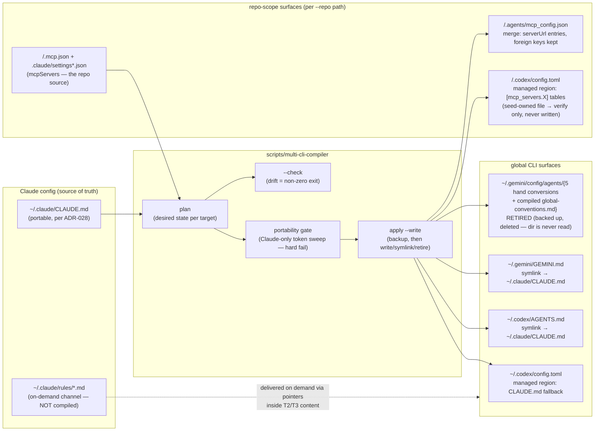

# Spec: multi-CLI config compiler

> Status: **FINAL for increments 1 (global scope) + 2 (repo-scope MCP)** — later increments
> extend this spec
> Date: 2026-07-11 · Revised same day: the Antigravity emit switched from a compiled
> always-on rule to a `~/.gemini/GEMINI.md` symlink after a sentinel probe showed
> `~/.gemini/config/agents/` is never read (nothing loads files there, always-on or otherwise)
> · Extended 2026-07-12 with increment 2: repo-scope MCP emitters, both targets sentinel-probed
> Anchor intent: [`docs/intent/personal-harness.md`](../intent/personal-harness.md)
> Related: [ADR-028](../decisions/ADR-028-portable-source-of-truth-per-cli-supplements.md)
> (strategy — locked), [`docs/reference/multi-cli-config-compat.md`](../reference/multi-cli-config-compat.md)
> (verified per-CLI facts — the emitters' ground truth), seed:
> `nxtlvl-lab/scripts/sync-agent-configs.ts` (repo-scoped prior art)

## Objective

One re-runnable compiler that makes the other four CLIs (Codex, Antigravity, Devin CLI, Grok
Build CLI) consume the Claude Code config as their single source of truth — by emitting **only
the mechanical residue** ADR-028 allows: format conversions, per-CLI supplements, and config
keys the native compat paths cannot supply. Never filtered instruction copies.

**Consumers:** the user (manual runs after config changes) and, later, a drift check in CI or a
session hook (informational only, per the hook-safety rule).

**Success criteria (testable):**

- `npm run compile-multi-cli` (dry run) prints an exact plan and writes nothing.
- `npm run compile-multi-cli -- --check` exits non-zero when any target file drifts from what
  the sources compile to, zero otherwise.
- After `--write`: Codex reads `CLAUDE.md` in repos with no `AGENTS.md` (global
  `project_doc_fallback_filenames`); Codex has global instructions; Antigravity loads the
  portable source through the `~/.gemini/GEMINI.md` symlink; `~/.gemini/config/agents/` is
  empty (the five stale 2026-07-04 hand conversions and the transitional compiled rule are
  all retired); every touched file has a backup.
- The compiler **refuses to emit** any instruction content containing Claude-only tokens
  (portability gate) — a non-portable source fails the run before any write.

## Scope / boundaries

- **In (increment 1):** global scope — machine-level CLI config surfaces under `~/.codex/` and
  `~/.gemini/config/`.
- **In (increment 2):** repo-scope MCP — `--repo <path>` compiles that repo's `mcpServers`
  (union of `.mcp.json`, `.claude/settings.json`, `.claude/settings.local.json`; later files
  win per name) into the Codex managed region and the Antigravity workspace
  `.agents/mcp_config.json`. Devin and Grok import `.mcp.json` natively — no emits.
- **In (later increments, see the plan):** skills/commands relocation, agent transforms,
  permissions demux; deeper per-CLI verification.
- **Out (non-goals, locked by ADR-028 and the compat doc's do-not-compile list):** filtered
  instruction copies; Codex memories; Devin Knowledge/Playbooks; Claude-harness-only surfaces
  (context & memory instincts, output styles, statusline).
- **Deliberately not emitted:** per-rule Antigravity copies of `~/.claude/rules/*.md`. The
  rules layer is on-demand by design — the `GEMINI.md` symlink delivers the source's pointer
  lines verbatim, and any CLI can read the rule files when triggered. This retires the
  2026-07-04 hand conversions instead of regenerating them. (The first build compiled an
  always-on `global-conventions.md` rule into `~/.gemini/config/agents/`; the sentinel probe
  then showed that directory is never read, so that rule is itself on the retire list and the
  symlink replaced it.)

## Architecture

Devin and Grok get **no global emits**: Devin reads `~/.claude/CLAUDE.md` and imports MCP
natively; Grok reads everything natively. Their compiler surface is verification only.

## Interfaces & contracts

| Contract | Definition |
|---|---|
| **Managed TOML region** | A marker-delimited block (`# --- nxtlvl-managed BEGIN/END ---`) the compiler owns inside a CLI-owned file. Inserted **before the first `[table]` header** (TOML top-level keys must precede tables); replaced in place on re-run; idempotent (second run is a byte no-op). Everything outside the markers is never touched. |
| **Codex global instructions** | `~/.codex/AGENTS.md` as a **symlink** to `~/.claude/CLAUDE.md` — delivers the portable source verbatim, zero drift. If Codex is ever shown not to follow symlinks, fall back to the seed's pointer-adapter file (verification catches this). |
| **Antigravity global instructions** | `~/.gemini/GEMINI.md` as a **symlink** to `~/.claude/CLAUDE.md` — the sentinel probe (2026-07-11) confirmed Antigravity loads `~/.gemini/GEMINI.md` always-on and that `~/.gemini/config/agents/` is never read, so a symlink delivers the portable source verbatim with zero drift. |
| **Retire list** | Exact filenames the compiler deletes as superseded: the five 2026-07-04 hand conversions plus the transitional compiled `global-conventions.md` from the first build. Guard: a listed file is only deleted if it looks like a compiler-known conversion (`trigger:` frontmatter); anything else is skipped with a warning — user-authored rules are never touched. |
| **Backups** | Before any overwrite or retire, the prior file is copied to `compiler-backup-workspace/<timestamp>/<original path>` in this repo (gitignored via the family `*-workspace/` convention). Backups live outside the CLI config directories so no CLI can accidentally load them. |
| **Modes** | Default = dry-run plan. `--write` = apply with backups. `--check` = drift gate (no writes, non-zero exit on drift). `--write` and `--check` are mutually exclusive. |
| **Portability gate** | Compiled instruction content matching the Claude-only token pattern (`dangerouslyDisable*`, `claude.ai/code`, slash-pipeline names, `/nxtlvl:`, `◆`) aborts the run before any write. This enforces ADR-028's authoring discipline at compile time. |
| **Repo MCP → Codex** | `[mcp_servers.<name>]` tables inside the managed region of `<repo>/.codex/config.toml` (HTTP `url`/`http_headers`, stdio `command`/`args`/`env`). Sentinel-probed 2026-07-12: loads in a trusted repo; Codex normalizes server names (hyphens → underscores) in its tool namespace. |
| **Repo MCP → Antigravity** | Merge into `<repo>/.agents/mcp_config.json`: HTTP servers as `serverUrl` entries (byte-compatible with the lab seed's output); foreign top-level keys and foreign servers preserved; invalid existing JSON aborts rather than clobbers. Sentinel-probed 2026-07-12. **stdio servers are not emitted** until their key shape is probe-verified. |
| **Seed-owned file guard** | A `.codex/config.toml` stamped with another generator's "Generated from" header (the lab's `stack.toml` flow) is never written — that flow regenerates the file whole and would erase a foreign managed block. The compiler emits a `verify` action instead: delivery of each server is asserted, and a miss reports `conflict` (fix belongs in `.agents/stack.toml`). |

## Constraints & decisions already locked

- ADR-028 §Decision 1–3: portable source of truth; supplements never copies; residue only,
  every emit paired with verification. Not re-litigated here.
- Per-CLI facts (formats, paths, discovery semantics) live in the compat doc — this spec
  points, it does not restate. Headline constraints honored by increment 1: Codex config is
  CLI-owned (→ managed region, not file ownership); Antigravity user config is
  `~/.gemini/config/`, never `~/.gemini/antigravity-cli/`.
- Toolchain: TypeScript run directly via Node ≥ 24 type-stripping (erasable syntax only), same
  as the rest of this repo. Pure transforms live in `emitters.ts` so tests never touch the
  filesystem.

## Verification

- **Unit tests** (`node --test scripts/multi-cli-compiler/*.test.ts`): managed-region
  placement, idempotency and replacement; rule compilation shape; portability sweep;
  retire-guard heuristic.
- **Drift gate:** `--check` after `--write` must exit zero; any manual edit to a managed
  surface must flip it non-zero.
- **Per-CLI smoke (manual, per ADR-028's verification requirement):** Codex — a run in a repo
  with no `AGENTS.md` sees CLAUDE.md content, and global instructions resolve through the
  symlink; Antigravity — a sentinel probe returns content from `~/.gemini/GEMINI.md` (through
  the symlink) and `~/.gemini/config/agents/` is empty; Grok — `grok inspect --json` still
  shows exactly the global + project CLAUDE.md pair (nothing this compiler emits may appear
  in Grok's stream).
- **Repo-scope MCP smoke (done 2026-07-12; probe recipe for re-verification):** scratch git
  repo with only a `.mcp.json` naming a sentinel server (`nxtlvl-probe-deepwiki`), compiled
  with `--repo <scratch> --write`, then each CLI asked to list its MCP servers — Codex
  (scratch temporarily trusted via a marker-delimited `[projects]` entry, removed after)
  must return the sentinel from the emitted managed block; Antigravity (`agy --new-project`)
  must return it from the emitted `.agents/mcp_config.json`. The sentinel name disambiguates
  from plugin-delivered servers (a plugin-scoped `deepwiki` exists globally on this machine).
- **Lab coexistence:** `--repo nxtlvl-lab` dry run reports everything in sync (the compiled
  `mcp_config.json` is byte-identical to the seed's; the seed-owned Codex file passes the
  delivery assertion), and the lab's own `sync-agent-configs --check` stays green.
