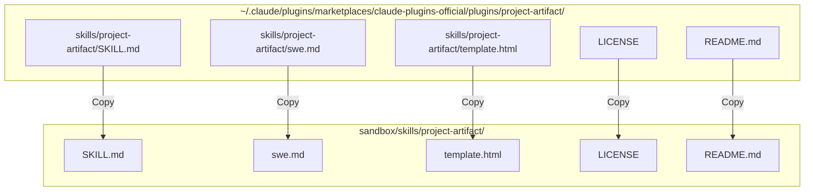

# SPEC-028: Importing project-artifact skill to sandbox

This spec details copying the official Claude Code `project-artifact` plugin's skill files into our staging sandbox so that it can be integrated into the `nxtlvl` harness.

## Context & Motivation

The `project-artifact` plugin is an official Anthropic Claude Code plugin that generates a tabbed HTML status page for a multi-workstream project and publishes it to a private `claude.ai/code/artifact/<uuid>` page.
This repository (`nxtlvl`) uses a staging sandbox pattern (`sandbox/{skills,agents,commands}/`) to isolate work-in-progress before promoting it to the live plugin (`plugins/nxtlvl/...`).
We will copy the skill files and its licensing/documentation to our sandbox under `sandbox/skills/project-artifact/`.

## Design & File Mapping

### File Layout

All target files will land in the following structure:
- [SKILL.md](file:///Users/willschaefer/developer/nxtlvl/sandbox/skills/project-artifact/SKILL.md): Explains the status page generation workflow and tabs configuration.
- [swe.md](file:///Users/willschaefer/developer/nxtlvl/sandbox/skills/project-artifact/swe.md): Explains the PR-based workflow specialization (X.Y numbering, live state queries).
- [template.html](file:///Users/willschaefer/developer/nxtlvl/sandbox/skills/project-artifact/template.html): The base template containing UI/UX styling and layout placeholders.
- [LICENSE](file:///Users/willschaefer/developer/nxtlvl/sandbox/skills/project-artifact/LICENSE): MIT/Anthropic license of the official plugin.
- [README.md](file:///Users/willschaefer/developer/nxtlvl/sandbox/skills/project-artifact/README.md): Plugin usage and setup documentation.

## Verification Plan

1. Verify that all 5 files are successfully copied and have correct content.
2. Verify that files in `sandbox/skills/project-artifact` do not get auto-loaded by the live harness (since `sandbox/` is off the discovery path).
3. The skill can be tested manually inside a test branch or staging workspace, or promoted via `git mv` when the user is ready.
