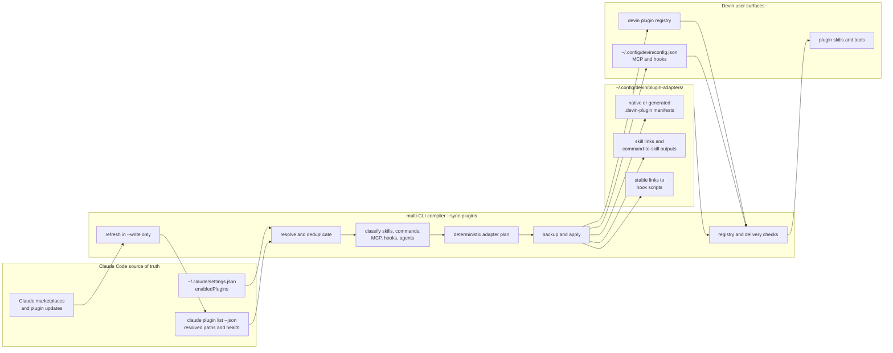

# Spec: Devin plugin parity from the Claude Code source

> Status: **Draft for review**
> Date: 2026-07-21
> Anchor intent: [`docs/intent/personal-harness.md`](../../intent/personal-harness.md)
> Related: [`ADR-028`](../../decisions/ADR-028-portable-source-of-truth-per-cli-supplements.md), [`docs/spec/nxtlvl-multi-cli-compiler.md`](../../spec/nxtlvl-multi-cli-compiler.md)

## Objective

Extend the multi-CLI compiler so Devin CLI mirrors the globally enabled Claude Code plugin set. Claude Code remains the configuration source of truth. The compiler refreshes enabled Claude plugins, adapts their supported components to Devin-native surfaces, installs the resulting Devin plugins, removes stale compiler-managed adapters, and verifies delivery.

The user runs one explicit synchronization command:

```bash
npm run compile-multi-cli -- --sync-plugins --write
```

Success means:

- Every plugin set to `true` in `~/.claude/settings.json` resolves to a healthy Claude installation or is reported as a blocking source error.
- Every healthy enabled plugin appears in `devin plugins list` under the same plugin name.
- Every source skill appears in `devin plugins info <name>`.
- Every source command has a generated Devin skill unless a same-name source skill already provides that entry point.
- Model Context Protocol (MCP) servers are available through an equivalent Devin server definition without duplicate processes.
- Compatible hooks are registered in Devin's user configuration.
- Unsupported components are enumerated by plugin and component; none are silently omitted.
- A second synchronization is a no-op apart from upstream update checks.
- `--check` exits nonzero when the enabled set, adapter content, Devin installation registry, MCP delivery, or hook delivery drifts.

## Scope and boundaries

### In scope

- The unique plugin identifiers enabled in the user-level `enabledPlugins` map in `~/.claude/settings.json`.
- Claude marketplace refresh and plugin update before a write-mode synchronization.
- Stable compiler-managed adapters under `~/.config/devin/plugin-adapters/`.
- Native `.devin-plugin/plugin.json` metadata when a source provides it.
- Generated Devin manifests when a source provides only a Claude manifest.
- Skills, command-to-skill adapters, MCP servers, and compatible lifecycle hooks.
- Safe pruning of adapters and Devin registrations previously created by this compiler.
- Backups before modifying `~/.config/devin/config.json` or replacing compiler-managed adapter state.
- Deterministic planning, writing, checking, and verification.

### Out of scope

- Disabled Claude plugins.
- Plugins enabled only in Codex, Gemini or Antigravity, or Grok.
- Claude output styles and status-line behavior.
- Automatic session-start or scheduled updates.
- Forking or vendoring third-party plugin content.
- Translating arbitrary Claude subagents into global Devin plugin components. Devin plugins currently bundle skills; unsupported plugin agents are reported.
- Modifying a broken Claude source definition to make synchronization pass.
- Overwriting foreign Devin plugins, skills, MCP servers, hooks, or adapter directories.

## Current enabled set

The source map currently contains fourteen enabled plugin identifiers:

| Plugin | Expected Devin delivery |
|---|---|
| `frontend-design@claude-plugins-official` | Skill adapter |
| `explanatory-output-style@claude-plugins-official` | Compatible hook adapter; generated usage skill if Devin requires a non-empty plugin |
| `skill-creator@claude-plugins-official` | Skill adapter |
| `context7@claude-plugins-official` | Existing equivalent MCP server; generated usage skill if needed |
| `nxtlvl-wiki@nxtlvl-dev` | Preserve native Devin manifest and skills |
| `nxtlvl-labs@nxtlvl-dev` | Preserve native Devin manifest and skills |
| `nxtlvl@nxtlvl-dev` | Preserve native Devin manifest and skills; reconcile MCP servers semantically |
| `codex@openai-codex` | Skills plus command-to-skill adapters; report unsupported agent or hook components that fail compatibility checks |
| `codebase-mapper@eigenwise-toolshed` | Skills plus compatible hooks |
| `playwright@claude-plugins-official` | Existing equivalent MCP server; generated usage skill if needed |
| `workspace-init@eigenwise-toolshed` | Blocking source error until the Claude marketplace resolves it or it is disabled |
| `i-have-adhd@i-have-adhd` | Skill adapter |
| `live-rules@eigenwise-toolshed` | Skills plus compatible hooks |
| `workbench@eigenwise-toolshed` | Skills plus compatible hooks |

Duplicate Claude installations of the same identifier are collapsed. The resolver prefers a healthy user-scope installation, then the newest healthy project-scope installation. Different versions of one identifier are not installed twice in Devin.

## Architecture



## Interfaces and contracts

### Command modes

| Invocation | Network updates | Filesystem writes | Contract |
|---|---:|---:|---|
| `npm run compile-multi-cli -- --sync-plugins` | No | No | Show the plugin parity plan from current local state. |
| `npm run compile-multi-cli -- --sync-plugins --write` | Yes | Yes | Refresh Claude sources, rebuild the plan, apply adapters and registrations, prune stale compiler-owned state, then verify. |
| `npm run compile-multi-cli -- --sync-plugins --check` | No | No | Compare current local source state with adapters, registrations, MCP servers, and hooks; exit nonzero on drift or source errors. |

`--write` and `--check` remain mutually exclusive. Plugin synchronization is additive to existing global and `--repo` compiler plans.

### Source resolution

1. Parse the user-level `enabledPlugins` object from `~/.claude/settings.json`.
2. Keep entries whose value is exactly `true`.
3. In write mode, run `claude plugin marketplace update`.
4. Update every unique enabled identifier with `claude plugin update <identifier>`.
5. Continue refreshing other plugins after one update fails, but retain every failure.
6. Read `claude plugin list --json` after refresh.
7. Resolve one healthy installation path per enabled identifier.
8. Treat missing paths, plugin-reported errors, malformed manifests, and update failures as blocking source errors.
9. Build and apply healthy adapters even when another plugin is blocked, then exit nonzero so partial parity is never reported as success.

### Stable adapter layout

Each enabled identifier maps to one compiler-owned directory:

```text
~/.config/devin/plugin-adapters/<plugin-name>/
├── .devin-plugin/
│   └── plugin.json
├── skills/
│   ├── <source-skill>/...
│   └── <source-command>/SKILL.md
└── source -> <resolved Claude installation path>
```

The adapter directory name uses the plugin manifest name, which is also Devin's global namespace. If two enabled identifiers claim the same name, synchronization stops with a collision rather than choosing one.

The `source` link is rewritten when Claude installs a new version at a new cache path. Skill directories link through the stable adapter to source content. Generated command skills are ordinary files because Claude command frontmatter is not guaranteed to satisfy Devin's skill schema.

### Manifest handling

- If the source has `.devin-plugin/plugin.json`, copy its supported metadata and dependency policy into the generated adapter manifest.
- Otherwise, generate a manifest from `.claude-plugin/plugin.json`.
- The generated manifest always uses the source plugin name.
- Unknown manifest keys are reported and omitted rather than passed through blindly.
- Third-party source files are linked or transformed into user configuration; they are never committed to `nxtlvl-core`.

### Skill handling

- Every `skills/<name>/SKILL.md` source becomes `skills/<name>/SKILL.md` in the adapter.
- A complete skill directory is linked so references, scripts, assets, and licenses remain available.
- The existing portability gate scans every exposed Markdown file.
- A same-name collision between two components of one plugin is resolved in favor of the source skill; the command is reported as already represented.
- A collision with a foreign adapter or global skill is blocking and is never overwritten.

### Command-to-skill handling

For every source `commands/**/*.md` without a same-name source skill, the compiler generates a Devin skill:

- The directory name and generated `name` use the command's relative slash path converted to a stable hyphenated name.
- Supported frontmatter is retained.
- Missing `name` is supplied.
- The command body is preserved.
- Claude-only invocation syntax is subject to the portability gate.
- Unsupported command metadata and unresolved plugin-relative references are reported as blocking adaptation errors.

### MCP handling

Plugin MCP definitions come from `claude plugin list --json` and source `.mcp.json` files.

- Equivalent servers already present in Devin count as delivered.
- Equivalence compares transport, executable or URL, package identity, arguments, headers, and environment-variable names while allowing an explicitly pinned package version to satisfy the same unpinned package identity.
- A same-name foreign server with different behavior is a blocking collision.
- An equivalent server under another name is reused to avoid duplicate server processes.
- Secrets are never copied as literal values. Environment and file references remain references.
- Compiler-created entries are marked in a sidecar ownership manifest because JSON MCP entries have no safe metadata field.

### Hook handling

Devin does not load hook files from installed Claude plugins. Compatible plugin hooks are merged into the user-level `hooks` object in `~/.config/devin/config.json`.

- Supported events are `PreToolUse`, `PostToolUse`, `PermissionRequest`, `UserPromptSubmit`, `Stop`, `SessionStart`, and `SessionEnd`.
- Command and prompt hooks are eligible.
- Hook commands run through stable adapter paths.
- `${CLAUDE_PLUGIN_ROOT}` is bound to the adapter's `source` link for compatibility.
- Known Claude tool matchers are translated to Devin tool names.
- Unknown events, matcher semantics, output contracts, or required environment variables are reported and not installed.
- Existing foreign hook entries are preserved.
- Compiler-owned entries are identified by an exact stable command prefix and reconciled without touching other entries.
- A hook must pass a fixture-based compatibility test before its plugin can be reported as fully delivered.

### Unsupported agents and other components

Plugin-level Claude agents have no general Devin plugin registration surface. The compiler inventories every source component and reports each unsupported agent, output style, or unknown directory. A plugin can be installed with partial capability only when every omitted component is explicitly listed. The final synchronization exits nonzero if an omitted component is required by a delivered skill or command.

### Ownership and pruning

A sidecar manifest at `~/.config/devin/plugin-adapters/manifest.json` records:

- compiler format version;
- Claude plugin identifier;
- source version and resolved path;
- Devin plugin name;
- generated and linked components;
- owned MCP server names;
- owned hook fingerprints.

Only paths and registrations present in this manifest are compiler-owned. When a plugin becomes disabled or disappears, write-mode synchronization removes its Devin registration and adapter after backup. Foreign Devin plugins and configuration entries are never pruned.

### Failure behavior

- Source refresh failures: continue other refreshes, apply healthy adapters, exit nonzero.
- Broken enabled plugin: report as blocking; never create an adapter from stale or malformed content.
- Name or component collision: preserve both existing sources, write neither conflicting target, exit nonzero.
- Invalid Devin configuration: abort before writing.
- Plugin install failure: retain the adapter for inspection, report the failed command, exit nonzero.
- Verification failure: retain applied state and backups, report exact drift, exit nonzero.
- No secrets or authentication files are read into compiler output or logs.

## Constraints and locked decisions

- ADR-028 keeps Claude Code configuration as the shared source of truth and permits only target-specific mechanical residue.
- New global Devin configuration lives under `~/.config/devin/`.
- Synchronization is explicit. No startup hook or scheduled task is added.
- `workspace-init@eigenwise-toolshed` is currently enabled but Claude reports that it is absent from the marketplace. Synchronization must expose this as a blocking source error until the source is restored or the plugin is disabled in Claude.
- Local Devin adapters point at Claude's installed cache, not development checkouts. Uncommitted local plugin edits therefore do not become live Devin behavior.
- Plugin update commands may fetch newer upstream code. Existing CLI trust prompts and plugin governance remain authoritative; the compiler does not bypass them.

## Verification

### Automated tests

Add unit tests for:

- enabled-map parsing and exact `true` filtering;
- duplicate installation resolution;
- native and generated manifest compilation;
- stable adapter paths;
- skill linking and collision handling;
- command-to-skill frontmatter conversion;
- MCP equivalence, semantic reuse, and collision handling;
- hook event and matcher translation;
- ownership-manifest reconciliation and foreign-entry preservation;
- broken plugin, malformed manifest, update failure, and partial-parity exit behavior;
- deterministic second-run output;
- `--check` drift detection.

### Compiler verification

Run:

```bash
npm test
npm run typecheck
npm run compile-multi-cli -- --sync-plugins
npm run compile-multi-cli -- --sync-plugins --write
npm run compile-multi-cli -- --sync-plugins --check
```

The final check must exit zero only when every healthy enabled plugin is delivered and no enabled source is broken.

### Devin verification

Run:

```bash
devin plugins list
devin plugins info <plugin-name>
devin mcp list
```

Compare the installed plugin names and skill inventories against the ownership manifest. Start a fresh Devin session and inspect `/hooks` to verify compiled hook source paths. Invoke at least one native-manifest skill, one generated third-party skill, one command-derived skill, and one MCP-backed adapter.

### Required first-run report

The first write-mode run prints a complete table with one row per enabled identifier and these columns:

- Claude identifier;
- source version;
- source health;
- Devin plugin name;
- skills delivered;
- commands adapted;
- MCP status;
- hook status;
- unsupported components;
- final status.

No aggregate success message is printed while any row is blocked, partial due to a required component, or unverified.
