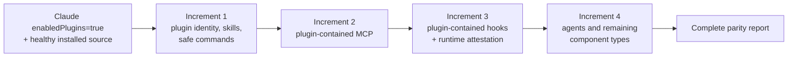

# Spec: Devin plugin parity program

> Status: **Approved decomposition**
> Date: 2026-07-21
> Anchor intent: [`docs/intent/personal-harness.md`](../../intent/personal-harness.md)
> Related: [`ADR-028`](../../decisions/ADR-028-portable-source-of-truth-per-cli-supplements.md), [`docs/spec/nxtlvl-multi-cli-compiler.md`](../../spec/nxtlvl-multi-cli-compiler.md)

## Objective

Make Devin CLI consume the globally enabled Claude Code plugin set without weakening ADR-028's native-import-first strategy. Claude Code remains the membership and update source. The multi-CLI compiler emits only plugin-contained residue that Devin cannot import natively.

The original single-increment design was rejected after two fresh-context reviews and two Codex reviews. Plugin identity, skills, commands, MCP servers, hooks, agents, ownership, secrets, and runtime verification do not share one safe write contract. The work is split into four increments.

## Program architecture



## Increment boundaries

| Increment | Delivers | Does not write |
|---|---|---|
| 1. Plugin identity and skill surfaces | Enabled-set inventory, source refresh, native/generated Devin manifests, immutable local skill snapshots, safe command-to-skill conversion, plugin registration, structural verification | Devin user config, MCP entries, hooks, agents, foreign registrations |
| 2. Plugin-contained MCP | Exact MCP source inventory, native-import deduplication, secret-safe canonicalization, owned user-config entries, MCP verification | Hooks, agents, foreign MCP entries |
| 3. Plugin-contained hooks | Supported event and matcher conversion, stable wrappers, ordering and ownership, fresh-session runtime attestation | Agents, unsupported hook types, foreign hooks |
| 4. Remaining components | Agents plus every source component still reported unsupported after increments 1–3 | Components without a documented safe Devin equivalent |

Each increment has its own specification, implementation plan, tests, write boundary, and acceptance gate. Later increments consume the prior ownership manifest but may not broaden an earlier increment's write scope silently.

## Shared contracts

- Membership is the exact set of user-level `~/.claude/settings.json` `enabledPlugins` entries whose value is `true`.
- Missing, malformed, duplicate-key, or wrong-type membership input fails before writes.
- Write mode refreshes Claude marketplaces and enabled plugins before compiling current source state.
- Healthy plugins proceed when another enabled plugin is broken; aggregate status remains nonzero.
- Every discovered source component receives `delivered`, `reused-native`, `unsupported`, `blocked`, or `runtime-unverified` status.
- Foreign Devin state is preserved. Ownership requires a compiler record plus an unchanged fingerprint.
- Dry-run and check modes write nothing. They return `cannot assess` if source or target state changes during inspection.
- Write mode is lock-guarded and crash-convergent. No increment claims a global transaction across external CLIs.
- Plugin changes become visible only in a fresh Devin session.
- Structural registration is not behavioral verification.
- Diagnostics never print credentials, environment values, authorization headers, or credential-bearing URLs.

## Source component completeness

The compiler inventories every source entry exposed by the Claude manifest and every top-level plugin entry. Known component types are classified by the owning increment. Unknown entries are reported explicitly. No directory, manifest key, or component is silently ignored.

A component assigned to a later increment keeps the current plugin status partial. An unsupported component remains nonzero until the user narrows the parity contract or a safe adapter is specified.

## Full-program success

Full parity requires:

1. Every enabled identifier resolves to a healthy source.
2. Every enabled plugin is registered in Devin under its source manifest name.
3. Every safely representable source component is delivered and structurally verified.
4. Every runtime-sensitive component has a recorded fresh-session attestation.
5. Every unsupported component is either adapted in a later increment or explicitly accepted by the user as a permanent platform limitation.
6. A final check reports no drift, ownership conflict, stale source, blocked source, or unverified required component.

## Constraints and accepted limitations

- `workspace-init@eigenwise-toolshed` is enabled but currently absent from its marketplace. It blocks full parity until restored or disabled in Claude.
- Devin's plugin registry has no documented machine-readable provenance field. Increment 1 installs but never automatically removes registrations.
- `codex@openai-codex` contains a plugin agent. Agent parity belongs to increment 4.
- MCP and hook parity cannot be inferred from plugin installation. They require separate user-config contracts in increments 2 and 3.
- This program extends ADR-028's existing multi-CLI configuration domain; it does not introduce a new architectural domain or require a separate ADR.

## Verification

Every increment must pass:

```bash
npm test
npm run typecheck
npm run compile-multi-cli -- --sync-plugins
npm run compile-multi-cli -- --sync-plugins --write
npm run compile-multi-cli -- --sync-plugins --check
```

The command gains capabilities incrementally. Its report always includes all enabled plugins and all discovered components, including components assigned to future increments.
