# Spec: Devin plugin parity increment 1 — identity and skill surfaces

> Status: **Draft for review**
> Date: 2026-07-21
> Consumes: [`2026-07-21-devin-plugin-parity-design.md`](2026-07-21-devin-plugin-parity-design.md)
> Related: [`ADR-028`](../../decisions/ADR-028-portable-source-of-truth-per-cli-supplements.md), [`docs/spec/nxtlvl-multi-cli-compiler.md`](../../spec/nxtlvl-multi-cli-compiler.md)

## Objective

Install every healthy, globally enabled Claude Code plugin into Devin under the same manifest name. Deliver native skills and commands that can be converted safely to Devin skills. Produce a complete component report for later increments without modifying Devin's user configuration.

This increment owns one command:

```bash
npm run compile-multi-cli -- --sync-plugins --write
```

Success for this increment means:

- The enabled membership source parses strictly.
- Every healthy enabled plugin has an immutable local adapter snapshot.
- Every healthy enabled plugin is registered in Devin.
- Every source skill is structurally present in `devin plugins info`.
- Every safely convertible source command is structurally present as a Devin skill.
- Every non-skill component is classified and assigned to a later increment or marked unsupported.
- No foreign Devin plugin or configuration is changed.
- A fresh Devin session can discover the installed skills.

A broken enabled source blocks aggregate success but does not block healthy adapters. `workspace-init@eigenwise-toolshed` is expected to exercise this path on the first run.

## Scope and write boundary

### Writes

- `~/.config/devin/plugin-adapters/` compiler-owned state.
- Devin plugin registrations created by `devin plugins install` for names absent before this compiler owned them.

### Does not write

- `~/.config/devin/config.json`.
- MCP servers.
- Hooks.
- Agents.
- Claude settings or source manifests.
- Claude caches or marketplace definitions directly; only official Claude update commands may modify them.
- Existing Devin registrations.
- Any project repository.

This narrow boundary avoids JSON-with-comments rewriting, secret-bearing configuration, hook ordering, MCP equivalence, and undocumented registry removal.

## Architecture

```mermaid
flowchart LR
    SETTINGS["strict enabledPlugins parse"]
    REFRESH["Claude marketplace + plugin refresh\nwrite mode only"]
    INVENTORY["claude plugin list --json"]
    RESOLVE["deterministic healthy source selection"]
    CLASSIFY["closed component inventory"]
    SNAPSHOT["content-addressed immutable snapshot"]
    CURRENT["atomic current symlink"]
    INSTALL["devin plugins install"]
    VERIFY["list + info structural verification"]
    REPORT["per-plugin component report"]

    SETTINGS --> REFRESH --> INVENTORY --> RESOLVE --> CLASSIFY
    CLASSIFY --> SNAPSHOT --> CURRENT --> INSTALL --> VERIFY --> REPORT
```



## Command modes

| Invocation | Network | Writes | Behavior |
|---|---:|---:|---|
| `npm run compile-multi-cli -- --sync-plugins` | No | No | Plan from current source and target snapshots. |
| `npm run compile-multi-cli -- --sync-plugins --write` | Yes | Yes | Refresh sources, build immutable adapters, install absent names, and verify persistent registry state. |
| `npm run compile-multi-cli -- --sync-plugins --check` | No | No | Detect source, adapter, current-link, inventory, or registry drift. |

`--sync-plugins` cannot combine with `--repo` in increment 1. Repo-scoped plugin membership is undefined, while this increment installs user-level Devin plugins. Mixing scopes would make global output depend on the invocation repository.

Dry-run and check create no lock or file. They hash source and target inputs before and after planning. A changed hash retries once; a second change returns `cannot assess`.

Write mode acquires an exclusive `sync.lock` before its authoritative membership parse and capability preflight. Lock acquisition failure stops before source refresh or writes. A preliminary parse may produce an early diagnostic, but only the post-lock parse controls membership.

## Capability preflight

The implementation is grounded against:

- Devin CLI `3000.2.17`, whose plugin commands provide install, list, info, update, remove, and prune; list and info do not provide JSON output.
- Claude Code `2.1.215`, whose plugin commands provide JSON inventory plus marketplace and plugin updates.
- Node.js 24.12 or newer, matching the existing compiler toolchain.

In write mode, the compiler checks the exact required command surfaces after lock acquisition and rechecks Devin and Claude versions immediately before registration. `devin plugins list` and `devin plugins info` parsers are version-pinned. An unexpected format, a mid-run version change, or an unsupported newer version returns `cannot assess` before registration changes. Re-grounding requires fixtures captured from the newer CLI and parser tests before widening the accepted range.

## Membership source

Parse `~/.claude/settings.json` with a strict duplicate-key-detecting JSON parser.

- `enabledPlugins` must exist and be an object.
- Every value must be boolean.
- Membership is every key whose value is exactly `true`.
- Missing, unreadable, malformed, duplicate-key, null, array, or wrong-type input blocks the entire run before refresh, planning, or writes.
- Plugin identifiers are sorted by normalized Unicode code point.
- The initial source file hash is rechecked before local apply. A changed membership file aborts the apply.

A missing identifier from a valid map means disabled. Increment 1 reports a previously owned registration as stale but does not remove it. Automatic removal is deferred until Devin exposes sufficient registration provenance or a separate destructive workflow is approved.

## Source refresh and resolution

Write mode:

1. Runs `claude plugin marketplace update`.
2. Attempts `claude plugin update <identifier>` for every enabled identifier.
3. Continues updates after a failure.
4. Reads one fresh `claude plugin list --json` inventory.
5. Redacts raw subprocess output from the report.

All subprocesses receive argument arrays through direct process spawning; plugin identifiers are never interpolated into a shell command.

Upstream updates are non-transactional. Earlier successful updates are not rolled back after a later failure.

Resolve duplicate installations in this order:

1. Healthy user-scope entry.
2. Highest valid semantic version.
3. Newest valid `lastUpdated` timestamp.
4. Lexical absolute installation path.

A final unresolved tie blocks that identifier. The inventory was verified to remain identical when run inside and outside a project checkout; a fixture test preserves this assumption.

A source is healthy only when:

- the inventory row has no errors;
- its installation path exists;
- its plugin manifest parses;
- its manifest name passes name validation;
- every selected skill and command source passes containment checks.

A failed update or unhealthy source keeps a prior immutable adapter only when its store digest, current symlink, and file fingerprints still match ownership. A missing or corrupted prior adapter is `stale-and-unavailable`; preserve all remaining state, block that plugin, and print manual recovery instructions. A healthy source may build a new digest normally. A corrupted existing store path that claims the desired digest blocks rather than being overwritten. No snapshot is built from stale or malformed source content.

## Complete source inventory

The planner inventories:

- every manifest key;
- every manifest-declared component path;
- every top-level file and directory;
- every skill directory;
- every command file;
- every symlink reachable from selected skill content.

Every entry receives an owning category:

- `manifest-metadata`;
- `skill`;
- `command`;
- `mcp` for increment 2;
- `hook` for increment 3;
- `agent` for increment 4;
- `runtime-resource` for scripts or assets referenced by a selected component;
- `documentation-license` for non-runtime documentation and licensing;
- `cache-housekeeping` for the known `.in_use` installer state;
- `other-known` for increment 4;
- `unknown`.

Nothing is omitted from the report. Documentation, licensing, and cache housekeeping are reported but do not count as runtime components. `unknown` blocks aggregate success until classified. Output styles and every other intentionally deferred type remain visible as later-increment components.

## Name and path safety

The source manifest `name` is the Devin plugin name. Never infer a name from the Claude identifier.

- Normalize names to Unicode Normalization Form C for comparison.
- Require `^[a-z0-9][a-z0-9._-]{0,99}$`.
- Reject absolute paths, separators, `.` and `..`, control characters, reserved names, and case-folding collisions.
- Resolve every selected source path and require it to stay inside the reported installation root.
- Reject escaping symlinks, cycles, broken links, and links into authentication or credential paths.
- Block two enabled identifiers that claim one manifest name.

## Dependency policy

Increment 1 does not allow plugin dependency expansion beyond the enabled membership set.

Any nonempty `requiredPlugins`, `optionalPlugins`, or `forbiddenPlugins` list blocks installation. The report identifies the key and entry count but does not invoke dependency resolution. Supporting dependencies requires a later specification that reconciles the dependency closure with enabled membership and foreign governance.

## Immutable adapter store

```text
~/.config/devin/plugin-adapters/
├── manifest.json
├── sync.lock
├── staging/
├── store/
│   └── <sha256>/
│       ├── .devin-plugin/plugin.json
│       └── skills/
└── plugins/
    └── <plugin-name> -> ../store/<sha256>
```

The snapshot contains only:

- one validated Devin manifest;
- validated complete source skill directories;
- generated command-skill directories;
- files reachable inside those skill directories;
- license files required by copied skill content.

It does not copy plugin MCP definitions, hooks, agents, `.git`, `.in_use`, caches, logs, histories, authentication data, or unrelated top-level content.

Build a snapshot under `staging/`, validate it, compute its digest, then rename it into `store/<sha256>`. Store entries are immutable. Update `plugins/<name>` through a temporary symlink plus atomic rename. The old store remains available, so an interrupted update or failed upstream refresh cannot break last-known-good delivery.

Snapshots are local runtime material, not vendored repository content. Increment 1 does not garbage-collect old store entries.

## Manifest generation

Allow these Devin fields only:

- `name`;
- `version`;
- `description`;
- `author`;
- `homepage`;
- `repository`;
- `license`;
- `keywords`.

Native Devin manifests with only allowed metadata are preserved after normalization. Claude-only manifests generate the same allowed metadata. Unknown functional fields block. Unknown nonfunctional fields block until added to a versioned allowlist.

Dependency fields are handled by the blocking rule above and are not copied into the adapter.

## Skill snapshots

For every `skills/<name>/SKILL.md`:

1. Validate the skill name and complete directory containment.
2. Parse frontmatter.
3. Preserve Devin-documented fields.
4. Translate tool names only through an exact versioned mapping.
5. Reject unknown required frontmatter.
6. Copy the complete contained directory into the immutable snapshot.
7. Verify every relative reference exists inside the copied directory.
8. Verify shebang interpreters are available when a referenced script declares one.
9. Scan text content for known Claude-only runtime placeholders.

Binary assets are copied but not interpreted. External services and dynamic runtime dependencies remain `runtime-unverified`. This status does not block structural installation, but it prevents a claim of behavioral verification.

## Command-to-skill conversion

A command is convertible only when all required behavior fits Devin's documented skill schema.

Supported source fields:

- `description`;
- `argument-hint`;
- `disable-model-invocation`;
- `allowed-tools`;
- Markdown body.

Generated fields:

- `name`;
- `description`;
- `argument-hint`;
- `triggers` derived from `disable-model-invocation`;
- translated `allowed-tools`;
- preserved body.

`$ARGUMENTS`, `${CLAUDE_PLUGIN_ROOT}`, background-task instructions, and Claude-only tool invocations require exact documented Devin equivalents. Without one, the command is `unsupported`; it is not partially rewritten.

A command and skill with the same basename are never deduplicated by name alone. Byte-equivalent behavior is `reused`; divergent behavior receives separate names or blocks if no safe name exists.

Canonical command paths use normalized POSIX separators. A unique safe basename remains the skill name. Collisions use `<basename>--<first-12-hex-of-sha256(canonical-path)>`. Every generated candidate is validated against the complete set of source-skill names, command names, status-skill names, and prior generated candidates before use. Full canonical paths are compared after hashing. Digest, case-folding, Unicode, source-skill, invalid-name, empty-name, and length collisions block.

## Component-only plugins

A healthy enabled plugin with no deliverable source skill or command still receives a Devin adapter containing one generated `<plugin-name>-status` skill. It reports:

- the source plugin is enabled;
- which components belong to later increments;
- which components are unsupported;
- that the status skill does not implement those components.

The generated status name must pass the same skill-name and full-set collision checks as command-derived names. Use `<plugin-name>-status` when valid and unique; otherwise use `status--<first-12-hex-of-sha256(plugin-name)>`. If neither candidate is valid and unique, block the plugin.

This permits plugin identity installation without falsely claiming functional parity.

## Ownership and registration

`manifest.json` records:

- compiler format version;
- Claude identifier, version, health, and source fingerprint;
- Devin plugin name;
- immutable store digest;
- current symlink target;
- expected skill names and content fingerprints;
- registration status;
- every deferred, unsupported, blocked, and runtime-unverified component.

Before installation:

- If the Devin name exists and no ownership record exists, it is foreign; block and preserve it.
- If ownership exists and the registration exists, require the current symlink and complete skill inventory to match the record.
- If owned adapter state or registered inventory changed, report foreign takeover or manual modification and do not reinstall.
- If ownership exists but the registration is missing, report `registration-missing` and stop for manual review. Do not silently undo a user's removal.

For a first installation, write `pending-install.json` with the plugin name, stable adapter path, store digest, expected skills, and source identifier before invoking:

```bash
devin plugins install -y ~/.config/devin/plugin-adapters/plugins/<name>
```

After installation, verify the complete registry and skill inventory. On success, promote the pending record into `manifest.json`, then remove the journal. On failure or interruption, retain the pending journal and adapter. The next run re-verifies that exact pending installation; it may promote a matching registration but may not install again, remove it, or overwrite a mismatch. The report includes the exact manual removal command when recovery needs user action.

The stable symlink path lets future snapshots update on the next Devin session without reinstalling the registry entry.

Increment 1 never calls `devin plugins remove` or `devin plugins prune`. Disabled or disappeared compiler-owned names are reported stale for manual review.

## Locking and crash convergence

Write mode creates `sync.lock` with exclusive-create semantics before the authoritative membership parse and holds it through ownership-manifest write. The JSON lock contains PID, process start time, hostname, command, and working directory; it contains no environment values or credentials. An existing lock is active when the PID is live with the recorded start time. A dead or mismatched PID is reported as stale, but the compiler never deletes the lock automatically. Recovery instructions name the exact lock path and require the user to confirm no compiler process is running before removal.

Local apply order:

1. Acquire the lock, then parse membership and preflight versions.
2. Validate complete desired state.
3. Build all healthy snapshots in staging.
4. Rename snapshots into immutable store paths.
5. Atomically update current symlinks.
6. Recheck membership and CLI versions.
7. Write a pending-install journal for each absent name, then install it.
8. Verify registry and complete skill inventories.
9. Promote verified pending records and write ownership manifest through temporary-file rename.
10. Remove promoted pending journals and release the lock.

An interruption leaves immutable snapshots, pending journals, or detectable target drift. The next run converges without deleting foreign or old state.

## Determinism

- Sort identifiers, plugin names, files, skills, commands, components, and report rows by normalized Unicode code point.
- Emit two-space-indented JSON with a final newline.
- Normalize relative paths to POSIX separators.
- Normalize text line endings to LF for fingerprints while preserving original copied bytes.
- Exclude timestamps from desired adapter content.
- Ignore source inventory order.

## Failure behavior

| Failure | Behavior |
|---|---|
| Invalid membership source | Abort all work before refresh or writes. |
| Lock unavailable | Abort before refresh or writes. |
| Update failure | Continue other updates; retain prior adapter; mark source `stale-blocked`. |
| Broken source | Retain only a fingerprint-valid prior adapter; otherwise mark `stale-and-unavailable`. |
| Corrupted immutable store | Preserve evidence, block overwrite, and print manual recovery instructions. |
| Unsafe name, path, or link | Block the plugin before staging. |
| Nonempty dependency policy | Block the plugin before installation. |
| Unknown component | Report and block aggregate success. |
| Unsupported command | Install other plugin skills; report plugin partial and aggregate nonzero. |
| Existing foreign Devin name | Preserve it; block that plugin. |
| Owned state changed manually | Preserve it; report collision. |
| Owned registration missing | Preserve adapter; report `registration-missing`; require manual repair authorization. |
| Install verification failure | Keep the pending journal; do not reinstall or auto-remove; print manual recovery. |
| Unexpected Devin output | Return `cannot assess`; do not start a new registration mutation. |
| Interrupted apply | Preserve immutable snapshots and pending journals; next run reports and converges. |

## Verification

### Automated tests

- Strict membership parse, duplicate keys, wrong types, and source hash changes.
- Version and command-surface preflight.
- Deterministic duplicate installation resolution.
- Complete component inventory with unknown-entry detection.
- Name validation, traversal, escaping links, cycles, case-folding, and Unicode collisions.
- Dependency-policy blocking.
- Native and generated manifest allowlists.
- Skill frontmatter, tool mapping, contained references, and interpreter checks.
- Command conversion, argument hints, unsupported runtime tokens, divergent same-name behavior, and injective naming.
- Component-only status skill generation.
- Content-addressed snapshot determinism and immutable current-link updates.
- Foreign-name preservation and owned-state modification detection.
- Lock metadata, live and stale PID handling, contention, staged interruption, and next-run convergence.
- Pending-install creation, verification promotion, failed-verification recovery, and missing-owned-registration handling.
- Version-pinned parsing of `devin plugins list` and `devin plugins info`.
- Byte-identical second runs and read-only check behavior.

### Compiler gate

```bash
npm test
npm run typecheck
npm run compile-multi-cli -- --sync-plugins
npm run compile-multi-cli -- --sync-plugins --write
npm run compile-multi-cli -- --sync-plugins --check
```

### Structural verification

For every healthy enabled identifier:

1. Confirm the plugin name in `devin plugins list`.
2. Compare the complete expected skill set with `devin plugins info <name>`.
3. Verify the current symlink resolves to the owned immutable digest.
4. Verify every snapshot file fingerprint.
5. Report every deferred, unsupported, blocked, and runtime-unverified component.

### Fresh-session smoke

Start a new Devin session. Invoke one low-side-effect skill from every plugin with delivered source skills. Invoke each generated component-only status skill. Do not run commands with external side effects solely for verification.

Structural synchronization can exit zero for increment 1 while runtime items remain labeled `runtime-unverified`. It may not claim full-program parity until later increments and human-gated smoke checks complete.

## Required report

One row per enabled identifier:

- Claude identifier;
- source scope, version, path, and health;
- Devin plugin name;
- immutable snapshot digest;
- source skills delivered;
- commands delivered or unsupported;
- deferred MCP, hook, agent, and other components;
- unknown components;
- runtime-unverified items;
- ownership and registration state;
- restart requirement;
- increment status;
- full-program status.

Never print environment values, headers, credential-bearing URLs, raw failing subprocess output, or file content from authentication paths.
