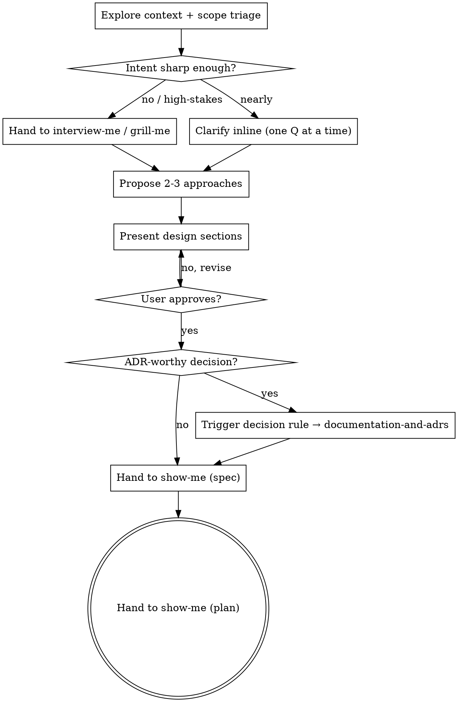

# Brainstorming → Design (nxtlvl)

The front door for creative work: turn an idea into a design the user has approved, *before* any implementation. Vendored from `superpowers:brainstorming` and re-shaped as a **front-door orchestrator** (compose on native, quality-first) — it owns only the parts your pipeline doesn't already have, and routes the rest to the native skills.

What this skill owns: the **approval gate**, **scope triage**, **exploring 2-3 approaches**, and **presenting the design**. Everything else is a handoff to a skill that already does it better — so the design that emerges here becomes the *input* to `/spec`, not a second artifact this skill writes.

## The gate — design before implementation

Do not invoke an implementation skill, write code, scaffold a project, or take any implementation action until you have presented a design and the user has approved it. This holds for every project regardless of perceived simplicity.

The reason is concrete: the cost of a wrong assumption is lowest before any code exists and rises sharply afterward. A five-sentence design that surfaces one bad assumption pays for itself many times over. The gate isn't ceremony — it's the cheapest place to be wrong.

This is firm, not absolute. If the user makes an informed call to skip ahead — they understand the design and choose to proceed — that's their override to make; record it and move on (router behavior #5: accept an informed override, don't be a yes-machine *or* a wall). What the gate prevents is *silent* drift into implementation on an unexamined guess.

## Anti-pattern: "this is too simple to need a design"

Every project goes through this — a todo list, a one-function utility, a config tweak, all of them. "Simple" work is exactly where unexamined assumptions cause the most wasted effort, because no one slowed down to check them. The design can be short (a few sentences for genuinely simple work), but it gets presented and approved. Scale the design to the work; don't skip it.

## What this skill owns vs. hands off

This is the heart of the front-door model. Resolve each row by the router's precedence (`nxtlvl ◆ → agent-skills → native`); don't reimplement what a native skill already owns.

| Phase | Owner |
|-------|-------|
| Explore project context, scope triage | **this skill** |
| Clarify intent when it's underspecified or high-stakes | → `interview-me` (surface) / `grill-me` (stress-test) |
| Generate variants from a rough, unfixed concept | → `idea-refine` |
| Propose 2-3 approaches + recommendation | **this skill** |
| Present the design, run the approval gate | **this skill** |
| Capture the approved design as a written contract | → `◆ show-me` — spec phase (`docs/spec/`) |
| Record an ADR-worthy decision made along the way | → the decision rule → `◆ documentation-and-adrs` |
| Break the contract into ordered tasks | → `◆ show-me` — plan phase (`docs/plan/`) *(terminal)* |

The skill's job is to drive the dialogue from idea to approved design and then route into that chain — not to carry it the whole way itself.

## Checklist

Create a task for each item and complete them in order:

1. **Explore project context** — files, docs, recent commits. Pointers over dumped content.
2. **Scope triage** — if the request is really several independent subsystems, say so now and decompose before refining details.
3. **Clarify intent** — one question at a time. Route by depth: a few inline questions if the idea is nearly sharp; hand to `interview-me` / `grill-me` if it's underspecified or high-stakes.
4. **Propose 2-3 approaches** — trade-offs, lead with your recommendation and why.
5. **Present the design** — in sections scaled to their complexity; get approval after each section.
6. **Hand off to `◆ show-me` (spec phase)** — the approved design becomes the written contract in `docs/spec/`. Record any ADR-worthy decision via the decision rule on the way.
7. **Continue into `◆ show-me` (plan phase)** — the terminal handoff to `docs/plan/`. Do not jump to implementation.

## Process flow

**The terminal state is the ideation→plan handoff.** Do not invoke `frontend-ui-engineering`, `incremental-implementation`, or any other build skill from here. Brainstorming ends by feeding the native pipeline.

## The process in detail

**Understanding the idea**

- **Check the current project state first**, so questions are informed, not generic. Spawn the read-only `context-scout` agent to sweep the project (files, docs, prior decisions, recent history) and hand back a pointers-over-content brief — keeping noisy exploration off the interview thread. **Before spawning it, hoist the mechanical half:** from the project root, run `bash "${CLAUDE_PLUGIN_ROOT}/scripts/project-snapshot.sh"` (the orchestrator has Bash; the scout deliberately does not), capture its stdout, and inline that into the scout's spawn prompt under a `## Pre-gathered snapshot` heading. The scout then digests the deterministic signals (recent commits, file sizes, the next collision-safe ADR number) instead of re-deriving them, and spends its judgment on relevance, prior art, and semantic gaps. The snapshot is **tree-shape aware**, so the accelerator also works for non-code ideas: a code tree yields the full snapshot, a non-code tree with content (notes, prose, a markdown repo) yields a *neutral* snapshot (code-only probes omitted, neutral labels), and only a truly empty tree prints `empty tree — nothing to snapshot`. **Fail-open — the snapshot is an accelerator, never a dependency:** if the script can't be located, errors, or prints the empty-tree line, just spawn the scout with no snapshot. Its behavior is then exactly as before.
- Triage scope early. If the request describes multiple independent subsystems ("a platform with chat, billing, and analytics"), flag it before spending questions on details of something that needs decomposing first. Help the user split it: what are the independent pieces, how do they relate, what order to build them. Then brainstorm the first piece through the normal flow; each piece gets its own design → spec → plan cycle.
- For appropriately-scoped work, ask questions **one at a time** — the user works best branch-by-branch, resolving one decision before opening the next. Prefer multiple-choice when it's faster to answer than open-ended. Focus on purpose, constraints, success criteria.
- **Know when to delegate the questioning.** Inline clarification is for an idea that's nearly sharp. When intent is genuinely underspecified ("build me X" with no who/why/when) or the stakes are high, that's `interview-me`'s job (extract intent to confidence) and `grill-me`'s job (relentless branch-by-branch stress-test). Hand off rather than running a shallow version of their loop yourself.

**Exploring approaches**

- Propose 2-3 genuinely different approaches with their trade-offs. Lead with your recommendation and the reasoning, conversationally.
- This is where you push back when warranted (router behavior #5): if an approach the user is leaning toward has a concrete problem, name it and quantify the downside, then accept an informed override.

**Presenting the design**

- Once you believe you understand what's being built, present the design in sections, each scaled to its complexity: a few sentences if straightforward, up to a few hundred words if nuanced. Ask after each section whether it looks right before moving on.
- Cover what matters for this design: architecture, components, data flow, error handling, testing. Be ready to go back and clarify when something doesn't fit.
- **Surface assumptions as you go** (router behavior #2). State what you assumed about intent or environment so a wrong assumption is visible now rather than silent — it often becomes the contract a later doubt cycle reviews against.

**Design for isolation and clarity**

- Break the system into units with one clear purpose each, communicating through well-defined interfaces, understandable and testable independently. For each unit you should be able to say: what it does, how it's used, what it depends on.
- The test: can someone understand a unit without reading its internals, and change the internals without breaking consumers? If not, the boundaries need work. Smaller, well-bounded units are also easier for *you* to reason about and edit reliably — a file growing large is usually a signal it's doing too much.

**Working in existing codebases**

- Explore the current structure before proposing changes, and follow existing patterns.
- Where existing code has problems that genuinely affect the work — a file grown too large, tangled responsibilities — fold targeted improvements into the design, the way a good developer improves code they're already in. But don't propose unrelated refactoring; hold scope to what serves the goal (router behavior #6).

## The seams — handing off to native

These are the composition points. Each is a skill that already owns its job; brainstorming routes to it rather than re-implementing it.

- **Intent → `interview-me` / `grill-me`.** When the idea is underspecified or high-stakes, extract and stress-test intent there, then return to approach-exploration with a sharp brief.
- **Variants → `idea-refine`.** When the concept itself is unfixed and you want divergent options before converging, that's the refine loop.
- **Contract + plan → `◆ show-me`.** The approved design is the input; the skill writes the spec to `docs/spec/` then the plan to `docs/plan/` with mandatory structural visuals. Brainstorming writes no duplicate design doc — the spec *is* the artifact.
- **Decision → the decision rule → `◆ documentation-and-adrs`.** If the design settles a decision that is *both* architectural and expensive to reverse, record it (see `~/.claude/rules/decisions.md`). Don't dilute the ADR set with facts (those go in the spec) or sequencing (that goes in the plan).

## Showing, not just telling — native visuals

Seeing a structure beats reading a description, and you value that — so when a question is about something visual or structural (a layout, a component boundary diagram, side-by-side options, a data-flow), render it rather than describing it. Use the native `visualize` tooling:

- Call `mcp__visualize__read_me` once before your first widget to load the rendering guidance, then `mcp__visualize__show_widget` for mockups, diagrams, and option comparisons.
- Decide per question: **render it** when the user would understand it better seen than read (mockups, wireframes, layout/option comparisons, architecture and data-flow diagrams); **stay in the terminal** for conceptual or text choices (requirements, trade-off lists, A/B/C/D scope decisions). A UI *topic* isn't automatically a visual *question* — "what does 'personality' mean here?" is conceptual; "which of these two layouts?" is visual.
- Don't gate visuals on cost or wait to be asked — for anything structural, default to showing it. That's the higher-quality path here.

## nxtlvl conventions

These cross-cutting behaviors come from the router and hold throughout — referenced, not restated:

- **Pointers over dumped content** — reference `file:line` and link; don't paste large blocks back.
- **Surface assumptions** — make guesses about intent/environment visible before acting.
- **Manage confusion actively** — on a contradiction or unclear requirement, stop and name it; don't design on a silent guess.
- **Enforce simplicity, hold scope** — prefer the boring, obvious design; YAGNI ruthlessly; cut features that don't serve the goal.

## Key principles

- **One question at a time** — branch-by-branch; don't overwhelm.
- **Multiple choice preferred** — easier to answer than open-ended when it fits.
- **Explore alternatives** — always 2-3 approaches before settling.
- **Incremental validation** — present, get approval, then move on.
- **Compose, don't duplicate** — if a native skill owns a phase, route to it.
- **Be flexible** — go back and clarify whenever something stops making sense.

## Verification

- [ ] Presented a design and got explicit approval before any implementation action (or recorded an informed override).
- [ ] Scope was triaged; multi-subsystem requests were decomposed before detailed questioning.
- [ ] Intent that was underspecified or high-stakes was routed to `interview-me` / `grill-me`, not shallow-handled inline.
- [ ] 2-3 approaches were offered with a reasoned recommendation.
- [ ] The approved design was handed to `◆ show-me` (spec then plan; no duplicate design doc written here), with any ADR-worthy decision recorded via the decision rule.
- [ ] Structural/visual questions were shown via the `visualize` tooling, not just described.

$ARGUMENTS
